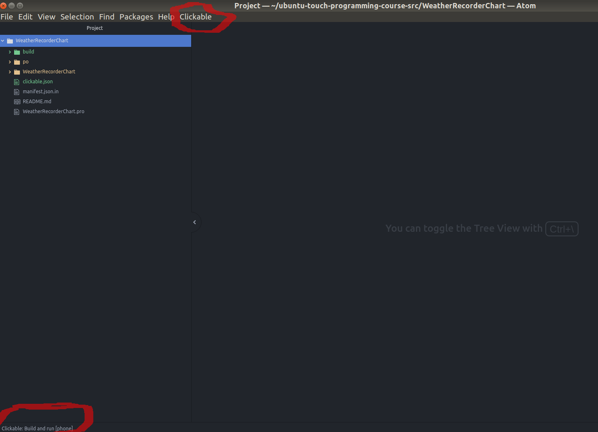

# Atom + clickable

## The new development environment

**The new environment changes ONLY the tools used for application development; ALL the concepts exposed in the previous chapters (QML, JavaScript...) are still valid!**
Also the source code doesn't need modifications to be compliant with the new environment.

In the previous chapters of this course we have used the Ubuntu SDK-IDE as "official" development tool.

Now the situation has changed: **The UBports community has decided to deprecate the SDK-IDE and its related tools** like the phone emulator (more info at: [Clickable for Atom](https://ubports.com/blog/ubports-blog-1/post/clickable-for-atom-98)).
The official UBports solution will be discussed in this section.

If you don’t want to leave the **Ubuntu SDK-IDE**, an unofficial alternative is to use the Virtual Machine based on 16.04 provided with this course. You can download it from [this link](https://drive.google.com/file/d/0B9PnbdpLgp86LWNYQ0JOcnNiTVE/view).


The **UBports** development environment is composed of three parts:
1. [Atom editor](https://atom.io/).
1. [Clickable](http://clickable.bhdouglass.com/en/latest/) as the tool to build, compile and run applications.
1. [atom-build-clickable](https://atom.io/packages/atom-build-clickable) an Atom plugin to use Clickable from Atom.

For more information, please refer to their respective websites; we’ll present only the necessary information.

## Clickable

**Clickable** is a command line tool to build, run and deploy Ubuntu Touch (UBports) applications. Currently the last stable version is 5.0.0. To install it or get the official documentation [visit this link](http://clickable.bhdouglass.com/en/latest/install.html).
We won’t cover installation here because that is already well explained on the web site.

**Note:** If you have a Nvidia graphic card, we suggest to use the open source Nvidia driver (named "Nouveau") not the closed source version, currently could be little issues using the new development environment.

All **Clickable** features are available with his executable named "clickable" (is not necessary be root to use it).

At configuration level introduces a new file descriptor named "**clickable.json**" to be placed in the root source folder of the application (the one with "manifest.json" and ".pro" files). See: [clickable.json Format](http://clickable.bhdouglass.com/en/latest/clickable-json.html for details).

That file descriptor is created when a **NEW clickable project** is created using the command "**clickable create**" (or "**clickable init**" for previous clickable versions).
In case of this file is missing (for example  application made  with Ubuntu-sdk-ide) we will show later how to create it.

## Atom

**Atom:** is an open source editor that can be extended with many plugins.
UBports community has developed a new plugin to add new features related at Ubuntu Touch application development.

Atom can be installed with “Ubuntu Software Center” or downloading the package from [Atom Web Site](https://atom.io/ )

If you choose the second installation method, to install it use this command (for Debian like distro):
```bash
sudo dpkg -i atom-amd64.deb
```

After a successful installation is necessary proceed with the installation of UBports plugin named [atom-build-clickable](https://atom.io/packages/atom-build-clickable )
Here we refer at the last available version, the 0.3.0

Search it from **Atom** menu: "Edit" → "Preferences" → "install". During the installation, if **Atom** ask you to install other plugins required by Clickable one, accept.

Current version of the plugin, allow to build and run applications without the use of command line (ie  use "clickable" command). NOTE: the plugin is currently under development and some features could be missing.

We suggest also to install the plugin "language-qml" (NOT developed by **UBports** community) to have a basic syntax highlight for QML files. Also a Javascript plugin available for Atom, can be useful.

**IMPORTANT**: "**atom-build-clickable**" plugin is active only when the opened folder/project contains the file descriptor "**clickable.json**" used by Clickable tool.
When active, you can see a "Clickable" menu entry in **Atom** menu bar and a new one in the bottom left part (next image).



## People who have collaborated

* Fulvio: author of the chapter.
* Miguel Menéndez: editor.
