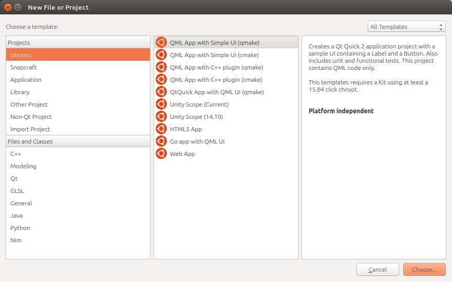
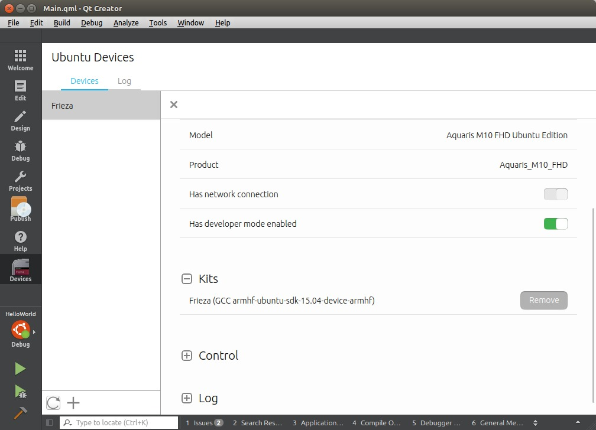

# chapter-02

## Introduction

In the previous chapter we have seen an introduction to the programming course with Ubuntu Touch. The next step is to prepare the development environment. When programming in any language a SDK \(Software Development Kit\) is used. The SDK consists of a set of tools that process the source code and generate the executable for the platform that is being used. Ubuntu Touch is not an exception and also has its own SDK.

Applications in GNU / Linux are in repositories. The repository contains a set of applications that can be easily installed. On some occasions there are applications that are not in the official repositories. For these cases, it is possible to use personal repositories, also known as PPA repositories. The Ubuntu SDK is in a PPA repository that will have to be added to the system in order to be installed. By this limitation, it can only be programmed on distributions that can work with PPA repositories, that is to say, all the distributions that use Ubuntu as a base. If the distribution uses RPM packages, as in the case of OpenSuse or Fedora, alternative measures will have to be taken.

There are two other ways to do this: create a Live USB with Ubuntu or use a virtual machine that has Ubuntu installed. The first one is simpler and works reasonably well if the USB memory is fast. The second way is more comfortable since it does not depend on a USB stick, but requires a more powerful computer to run the virtualized operating system. I will not go into how to create a Live USB or virtual machine. Anyone in one of these two cases can ask in the mailing list and I will guide him with the most important steps.

My development environment is:

* Ubuntu 16.04 LTS.
* Aquaris E4.5 with OTA-14.
* Aquaris E5 HD with OTA-14.
* Aquaris M10 FHD with OTA-14.

It is possible that in other distributions there are some intermediate steps that need to be done to configure the SDK. If that is the case you can indicate it.

## Installing the Ubuntu Touch SDK

Installing the SDK is very simple and should not take more than a couple of minutes. It is advisable to have the system updated before you start. For the case of Ubuntu, this can be done with the commands:

```bash
sudo apt-get update && sudo apt-get upgrade && sudo apt-get dist-upgrade
```

You use sudo because package installation requires administrator permissions. The first command updates the list of repositories. If there is no error, the second command is executed, which is responsible for updating the applications. Finally the third command updates some operating system packages that are not updated by default.

Add the Ubuntu Touch SDK repository with the command:

```bash
sudo add-apt-repository ppa:ubuntu-sdk-team/ppa
```


The repository information will be displayed. You can continue by pressing the ENTER key.


All repositories have a signature that assures us that the installed packages come from the repository. This signature is added to the system and will be used when repository packages are installed.


After adding a repository it is necessary to update the information of the packages that it contains. You can do this with the command:

```bash
sudo apt-get update
```

Everything is ready. The last step of this section is to install the Ubuntu Touch SDK.

```bash
sudo apt-get install ubuntu-sdk
```


Although only one package \(ubuntu-sdk\) is put in the command, all the dependencies of that package are automatically installed, so it works without problems. The installation may take a while depending on the Internet connection. It's a good time to let the computer work and have a good coffee.

## Setting up the Environment

The Ubuntu Touch SDK includes tools to generate applications and an editor to make programming easier. The tools take the source code of the application and process it. If the target is a computer there is no problem. Instead, if the target is a device that uses Ubuntu Touch, we are in a different scenario. These devices use the ARM architecture, which is different from the one used by the PC. To generate the executable you have to use a cross-compiler that runs in a container \(LXD in the latest versions of the SDK\).

To work with LXD you have to add the user that is used on the computer to the group lxd.

```bash
sudo usermod -a -G lxd user
```


After writing the command you have to close the user's session and login again. You can start working with this small modification. To start, we need to run the ubuntu-sdk-ide application, it can be launched from the desktop start menu or by pressing ALT + F2 and typing its name. The first time it’s launched, a screen appears asking in which lxd has to be configured. Just press ‘Yes’ to generate the default configuration.


If the user is not in lxd group, the following error shown in the screen will be output. In that case, it is sufficient to logout and login again. When launching the IDE of Ubuntu Touch should give you no errors.


## Configuration Wizard

The first screen of the wizard is an introduction to Qt Creator. To continue, click the ‘Next’ button.


Although the course is focused on mobile devices such as phones or tablets, you will also apply the knowledge learn to create desktop applications. Each of these devices has associated a kit, a set of tools, which are based on the code that is programmed and generates the necessary files for each device.


Click the ‘Create new Kit button’. The first option must be selected.


In the list there are several kits to download. Ubuntu Touch is currently based on Vivid so you have to select that option.


Finally write the name of the kit.


When you complete the last step, you return to the initial screen of the kits. Press the ‘Create new Kit’ button again and repeat the process by selecting Ubuntu Device.


With this kit there are more options to choose from. Phones or tablets that use Ubuntu Touch work with the armhf architecture. In the list you have to select a kit that has that architecture. The version of Ubuntu Touch is Vivid, as in the previous case. Finally you have to choose 686 or x64 depending on whether the computer uses 32 or 64 bits.


After pressing the ‘Next’ button, you must write the Kit name.


At this time it is not necessary to create additional kits.


In the last step of the wizard you can configure the physical devices and the emulator. There are some problems with the emulator. For now, I recommend not to configure the emulator. Applications can be tested natively on the computer. For this reason you must uncheck the ‘Create emulator’ box and click on the ‘Finish’ button.


## Hello World

In order to keep the good traditions, the first step is to program a minimal application that allows us to check the correct operation of the SDK. The application will run on the computer natively and on a tablet. As you will see is quite simple to do it. Kits are updated frequently. If the following screen appears, all the kits must be marked and updated.


### Project Creation

Click on the File menu, New file or project. A window will appear with the types of projects that can be used. The user interface is made with QML which is a scripting language oriented to the creation of graphical interfaces. The logic of the application can be done with several languages. JavaScript will be used for now. Select the first option and then click on the ‘Choose’ button.



You must choose the folder in which the projects will be saved. The project name cannot contain spaces.


Applications need basic information: user and maintainer. All other parameters should be left as they come by default. It is important to respect the structure in the Maintainer field so that it allows us to continue.


You have to select the kits that you want to use. By default the two will be selected in order to run the application on the computer and on the mobile device.


The last screen contains a summary of the wizard steps. Click on the ‘Finish’ button.


The project will open automatically.


### Running the Application on Your Computer

To run the application you have to press the ‘Play’ button in the lower left part of Qt Creator.


### Running the Application on a Real Device

Before running the application, it is necessary to configure the device. For testing I have used an Aquaris M10 FHD tablet with the OTA-14 —although the procedure is the same on the other terminals. Leave ubuntu-sdk-ide open and connect the device via USB to the computer. To activate the development options, access the System Settings.


Click on About.


Select Developer Mode. This mode is disabled by default because it allows remote control of the device if it is connected by USB to the computer. Check the box.


After a few seconds, a notification must appear with the connection request of the computer.


You have now completed all the steps on the side of the tablet. In the IDE, you must select the tablet as the compilation target. To do this, click on the button above the Play and select the device we just configured as the destination.

A few seconds after pressing the Play button, the application will appear on the device.


The error shown in the following image may appear:


In the sidebar of Qt Creator you have to click on the ‘Devices’ button. Then click on the device and Kits click on the ‘Remove’ button. Then click on the ‘Create’ button.



Now you have to associate the Kit back to the Project. Click on ‘Projects’ \(on the sidebar\), ‘Add Kit’ and select the Kit that appears in the dropdown.


Wait a couple of seconds and select the device as the compilation target. It is important that you try the compilation in both cases. In the next chapter I will start with the source code and assume that everything works correctly on both the computer and the test device. If you have any problems you can ask on the mailing list.

## People who have collaborated

* Larrea Mikel: revision of the chapter in Spanish.
* Cesar Herrera: revision of the English translation.
* Joan CiberSheep: revision of the English translation.

