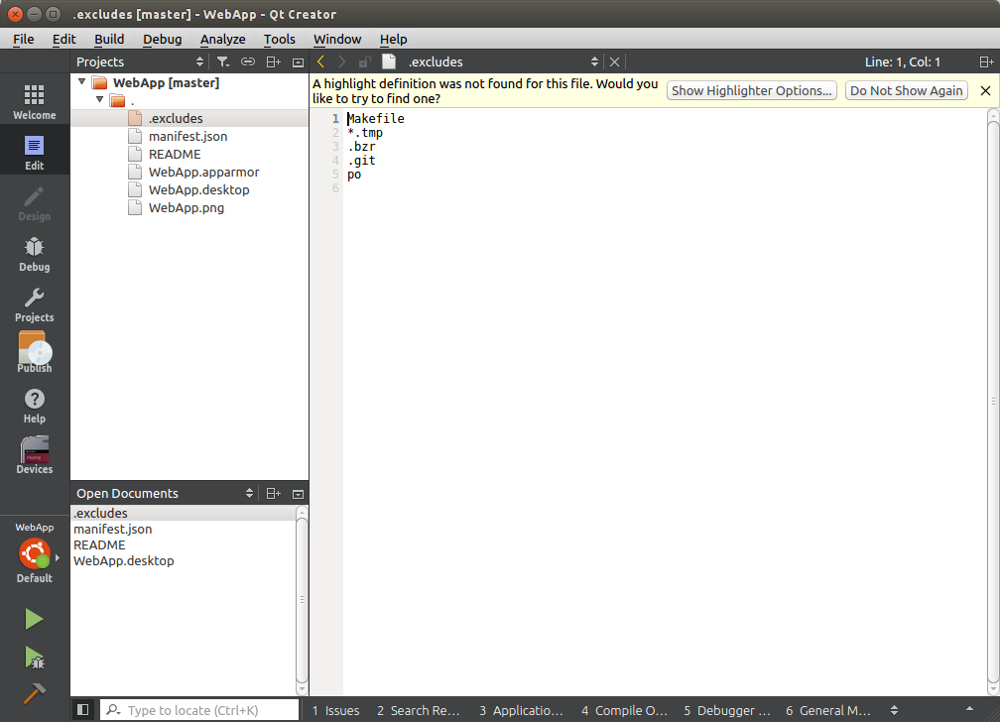
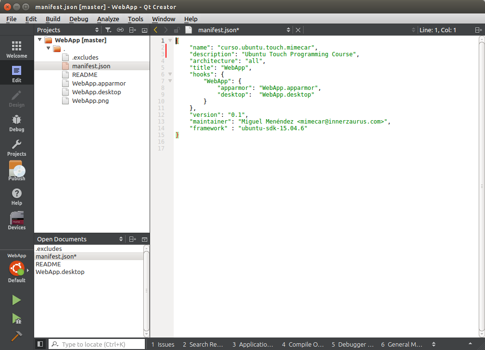
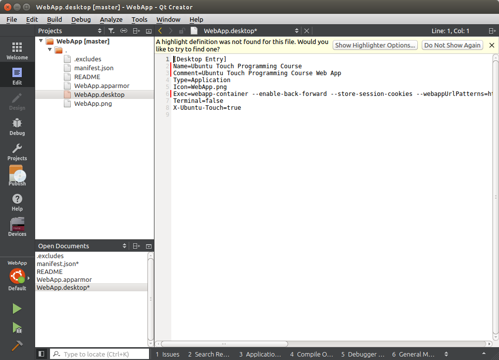
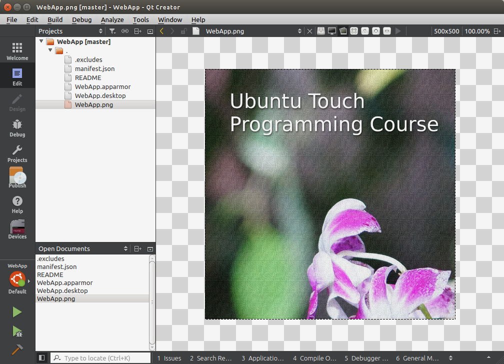
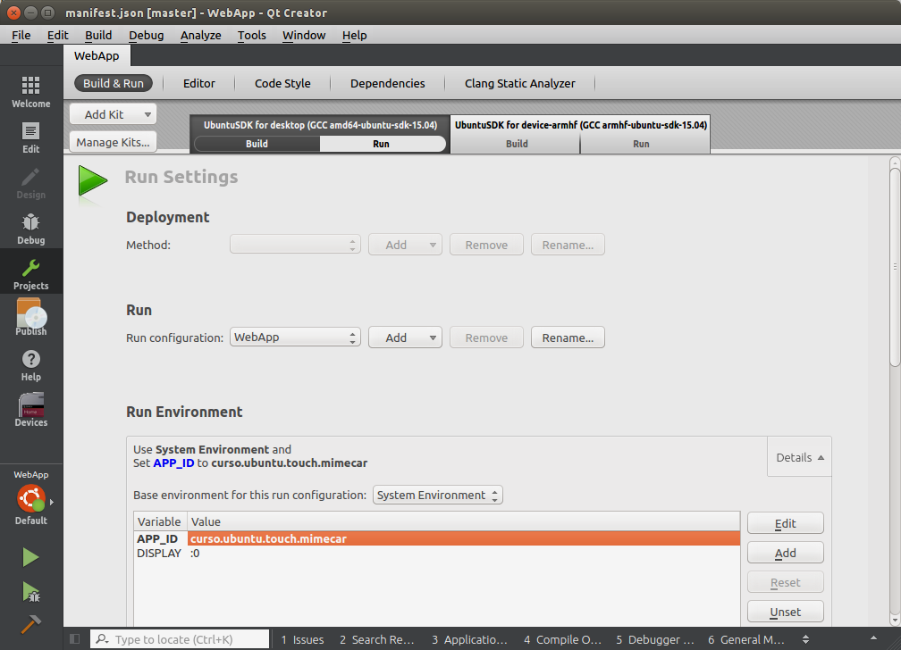
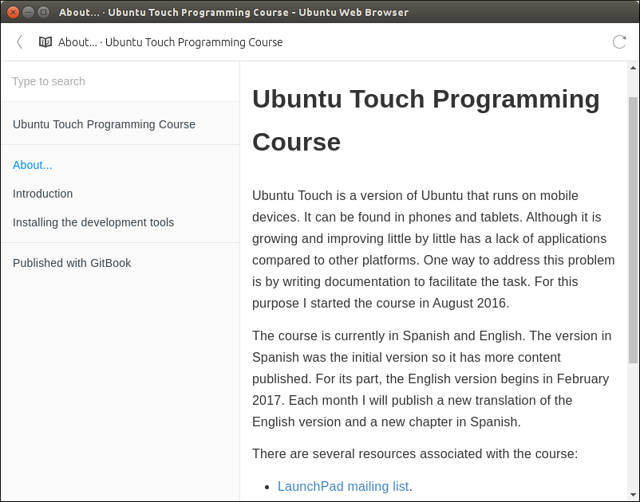
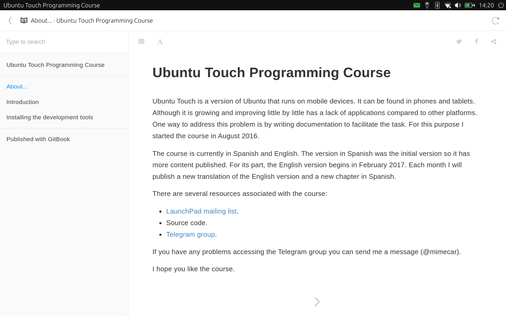
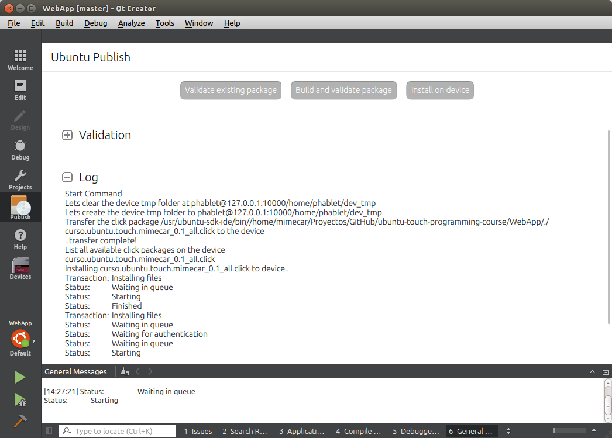
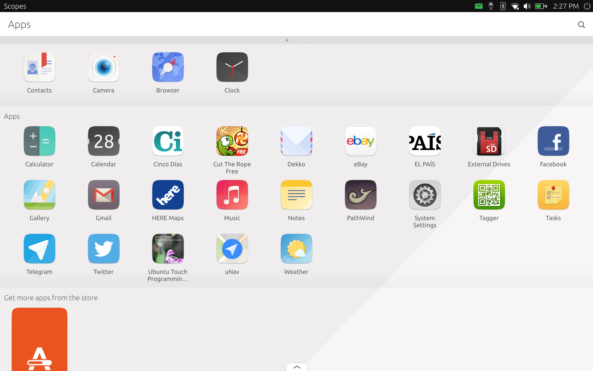

# Introduction
In this chapter we’ll  study the creation of a Web App and will go through all phases of the process, ending with the creation of a click package for Ubuntu Touch. To complete this chapter it will  be required to have the Ubuntu SDK installed. It is also advisable to have completed the sample applications from the previous chapter.

# Web App, also known as Web Application

## What is a Web App?

A Web App is a type of Ubuntu Touch application. It works by displaying a web page as if it were a standalone application. Like any other application, it will appear in the scope of applications and can be managed from the Ubuntu Store. You may wonder why display a web page as an app if the browser already does that natively.

Internally, the browser and a Web App share the same code base. The difference is that the Web App is isolated, so it does not share information with the browser. Also the user can only open URLs that match a filter that is previously defined. However, this type of applications has a limited access to device resources. If you need to access these resources you must write a native application.

From the programming point of view, a Web App is the easiest type of application that can be found: just define the URLs that you are interested in. It’s really simple to make and the SDK does all the work for you. To distribute a Web App it is necessary to package it as a click package that can be uploaded to the Ubuntu Store. Once uploaded to the Ubuntu Store, a Web App is automatically added to [uApp Explorer](https://uappexplorer.com/apps?type=webapp).

## Creation of the project

To create a new project click on the button New Project. Another way to do this is from the File menu, New File or Project.

A window will appear with the project types that can be created. You have to select Web App. As shown in the description, it is a project independent of the platform and with limitations in the access to the resources.

You must select the path in which the project will be saved. Remember that you can not use spaces or characters with accents.

Fill in the application information.

You have to select the Kits that will be used. As it is interesting to generate a computer executable (Desktop) and for the device (Ubuntu), you have to leave both ticked. The Desktop Kit always has to be selected by default otherwise, you will need to restart the ubuntu-sdk-ide configuration.

The last step shows a summary. I recommend using version control for the applications you write. It allows you to quickly return to specific points of development easily. This also controls changes between different versions of the code making it easier to fix bugs.

The wizard is now complete. The project opens automatically.

## Structure of the project

The project of a Web App is very simple and consists of several files.

* .excludes: extensions and folders that are out of IDE parse.

* manifest.json: contains the application information that will be displayed to the user. This file is processed automatically when you upload the application to the Ubuntu Store.  All applications have an associated name that is added to all packages. In the example is the text ".mimecar".

* WebApp.apparmor: application permissions.

* _WebApp.desktop:_ information for the App Scope to launch the Web App.

* _WebApp.png:_ application icon.

## Modifications

There are three modifications to the template provided by the Ubuntu Touch SDK. The first one is to change the URL that is opened by the WebApp.desktop file. You have to change the URL that is displayed in the Exec line. URLs that are within the same domain will appear in the Web App. If you click on a link that goes to another domain, it will be opened in the web browser.

`Exec=webapp-container --enable-back-forward --store-session-cookies --webappUrlPatterns=https?://m.WebApp.com/* http://m.WebApp.com %u`

Must be replaced by:

`Exec=webapp-container --enable-back-forward --store-session-cookies --webappUrlPatterns=https?://mimecar.gitbooks.io/ubuntu-touch-programming-course/content/* https://mimecar.gitbooks.io/ubuntu-touch-programming-course/content/ %u`

The next step is to replace the icon file (WebApp.png) with a PNG image. This image will be the app icon displayed in the scope. The resolution must be 256x256 or higher.

Finally, open the manifest.json file and complete the application information.

## Web App Testing

Press the Play button to launch the application on the desktop. The Desktop kit is selected by default. Note that the SDK template has a bug that does not allow launching the application.

To solve this follow this steps:
* Project button (left sidebar).
* Under Kit, select 'Run'.
* Click on the combo that appears next to 'Run Environment'.
* Click on the Add button and put the data shown in the screen capture.

The value of APP_ID must match the 'name' field in the file 'manifest.json'

If you select Ubuntu Target Kit, you can see the result on the device. It is important that the circle next to the Ubuntu Kit is green. Otherwise there will be no connection to the device.

# Creating the click package

The Web App works on the device but only while it is connected to the computer. To remain permanently on the device, it is necessary to install it on the system using a click package. Click on the Build and validate click package button.

If there is no problems, click the Install on device button. It is possible that it gives a connection problem. If so, go to Devices, select the device and in the section Control click on the button Open SSH connection to the device.

The result is the application installed on the device.

# Conclusions

A Web App is very simple to program. The Ubuntu Touch SDK does most of the work. The Web App disappears when the device is disconnected. To install it, you must create a Click package. If you want to share the application with other users, you have to publish the Click package in the Ubuntu store.

# References
[Web App tutorial](https://developer.ubuntu.com/en/phone/web/tutorials/web-app-tutorial/)

# Source Code
* [Source code on GitHub](https://github.com/mimecar/ubuntu-touch-programming-course).

# People who have collaborated
* Larrea Mikel: revision of the chapter in Spanish.
* Cesar Herrera: revision of the English translation.
* Joan CiberSheep: revision of the English translation.
