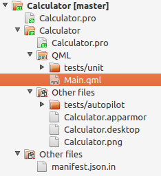
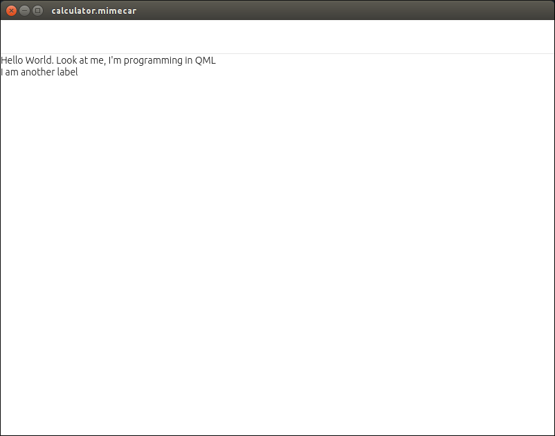

# Introduction to QML language

QML is a language that is based on JavaScript and is used to create the user interface of an application. It allows you to use both traditional components (buttons, lists, etc.) and graphic elements to which logic is added. An example of the first case is the Ubuntu Touch user interface. For the second case there are several examples on the [QT Web](https://www.qt.io/ui/). QML handles the visualization but not the logic that implements the application.

This logic can be written in several languages, depending on the needs we have. If the application is a game and needs computing power, the language chosen would be C/C++. On the other hand, if the performance of the app is not critical, you can use JavaScript. At the moment the applications of the course will use JavaScript and later will be written in C/C++.

## Creation of the project

The configuration of the project must be the following:
* Project type: QML App with Simple UI (qmake).
* Kits: select all installed kits.

The project will be created with the chosen template and will open by default, the user interface (QML) file.


The structure of the project varies slightly comparing it to the one that had the Web App.



Files that can be modified are displayed in bold type. The remaining files are for internal use of the IDE and should not be modified.
* Calculator.pro: main project file.  
* Calculator
  * Calculator.pro: information for the compiler.
  * QML
    * Tests / unit: The files in this folder are used to make validations of the application.
    * **Main.qml:** file containing the user interface of a screen.
  * Other files
    * Tests / autopilot: The files in this folder are used to run the application.
    * **Calculator.apparmor:** application permissions
    * **Calculator.desktop:** application information for the application launcher.
    * **Calculator.png:** application icon.
  * Other files
    * **Manifest.json.in:** information for the Ubuntu store with application data.

The IDE has a tab that with the text 'Design'. This tab analyzes the generated QML code and converts it into the user interface. The tool does not work well and gives errors even if the QML code is valid.

You can see this on the project screenshot on the words that are marked in red on lines 23, 24 and 25. For this reason, user interface tests will be performed by running the application on the computer.


# Structure of the QML file

All QML files have a common structure that you will see below. QML allows you to use a number of components that are already defined. This information is passed to the project with the import statement. It is possible to use different versions of the components although it would be normal to choose the latest available version.

```js
import QtQuick 2.4
import Ubuntu.Components 1.3
```

## Comments
Comments are guides that the programmer writes about specific parts of the code. I recommend writing comments on code parts that are complex. It is best to write them when the code is still fresh. If you wait a while you may not remember all the details.

Comments can be write in two ways:

* If the comment has several lines you can use
```js
/*
 * Description
 */
```
* Whereas if you have only one line

 ```js
 // Description
 ```

* In the sample code it looks like this:
```js
/*!
 \brief MainView with a Label and Button elements.
*/
```

## MainView
MainView is the root element of the user interface. It automatically adapts to the rotation of the device.

```js
MainView {
```

This block of code doesn’t need to be modified. It is used internally.

```js
// objectName for functional testing purposes (autopilot-qt5)
objectName: "mainView"

// Note! applicationName needs to match the "name" field of the click manifest
applicationName: "calculadora.innerzaurus"
```

## Grid Unit
The next two statements are responsible for defining the initial size of the screen. An important detail is that the dimensions are not defined in pixels but in some units called gridUnits (gu). The reason to invent new units and not using pixels that already exists is that gridUnits is universal to the different screen sizes and translates. An example will make this clear.

Suppose that we have a device with a resolution of 600 x 800 pixels. If a rectangle is defined with the dimensions 300x800 pixels, will occupy the middle of the screen. Now if you use a device that has a screen resolution of 1080x1920 pixels, the rectangle will not reach the middle of the screen. To avoid this problem, define the dimensions in gu (gridUnit). If the dimensions are defined in gu, internally, the system will calculate those dimensions with the characteristics of the screen. The final result will be that the rectangle always has the same size regardless of the screen resolution.

```js
width: units.gu(100)
height: units.gu(75)
```

## Page
The Page element defines a view. It is recommended that it be included within a MainView element (our specific case) or an AdaptivePageLayout element. It contains a header with an identifier, title and style that applies to the elements of the header. The style is defined within the StyleHints element.

```js
Page {
  header: PageHeader {
  id: pageHeader

  title: i18n.tr("Calculator")

  StyleHints {
    foregroundColor: UbuntuColors.orange
    backgroundColor: UbuntuColors.porcelain
    dividerColor: UbuntuColors.slate
  }
}
```

## Run Demo
To see the user interface that is created it is necessary to click on the Play button. Although you can also try on a physical device I recommend that you work with the desktop. The test process is faster and at first you will use it a lot.


In the default QML file there are several components. To make it easier to learn it will be created from scratch with a more detailed explanation. You have to delete the lines from 28 to 53.


# Creating the Calculator Interface

Below you will see an initial design of the calculator with labels. It will help to introduce the way components works and will get a minimum base to continue with QML.

## Label

A label is a component that displays text. Its minimum structure is:

```js
Label {
  text: "Hello World"
}
```

Add the following code from line 28. Then run the application on the desktop.

```js
Label {
  text: "Hello World. Look at me, I'm programming in QML"
}

Label {
  text: "I am another label"
}
```

Now comment the lines in the header and run the application.


The labels are shown, but the two are overlayed. In one hand there is the definition of the component and on the other hand, its organization. If the header is displayed, the tags do not show and if the header is removed the tags overlap.

## Component Organization
Components can be organized in rows, in columns or in a grid —that combines rows and columns. To distribute labels in a column they have to be inside a Column element.


```js
Column {

  Label {
    text: "Hello World. Look at me, I'm programming in QML"
  }

  Label {
    text: "I am another label"
  }

}
```

With this modifications we can see the improvement.



When you restore the header code, the labels disappear again. It's not that qml doesn’t like us. The labels are actually hidden by the header, so it is necessary to define a relation between the header and the column

```js
Column {
  anchors.top: pageHeader.bottom

  Label {
    text: "Hello World. Look at me, I'm programming in QML"
  }

  Label {
    text: "I am another label"
  }

}
```

The result is the expected now.


# Exercises
In the previous chapters you finished the exercises too quickly. In this chapter this will not be the case. The exercises are:

* **Exercise 01.** Create three columns one after the other and show the numeric keypad numbers (1, 4, 7, 2, 5, 8, 3, 6, 9; 0).

* **Exercise 02.** Distribute keypad numbers as a table by combining columns and rows. The element to create the rows is Row and is used similarly to the element Column. You may use the documentation included in  the SDK but you may not search the solution on the Internet. To view the SDK documentation, press the F1 key with a QML component selected.

# Source Code
* [Source code on GitHub](https://github.com/mimecar/ubuntu-touch-programming-course).

# People who have collaborated
* Larrea Mikel: revision of the chapter in Spanish.
* Cesar Herrera: revision of the English translation.
* Joan CiberSheep: revision of the English translation.
