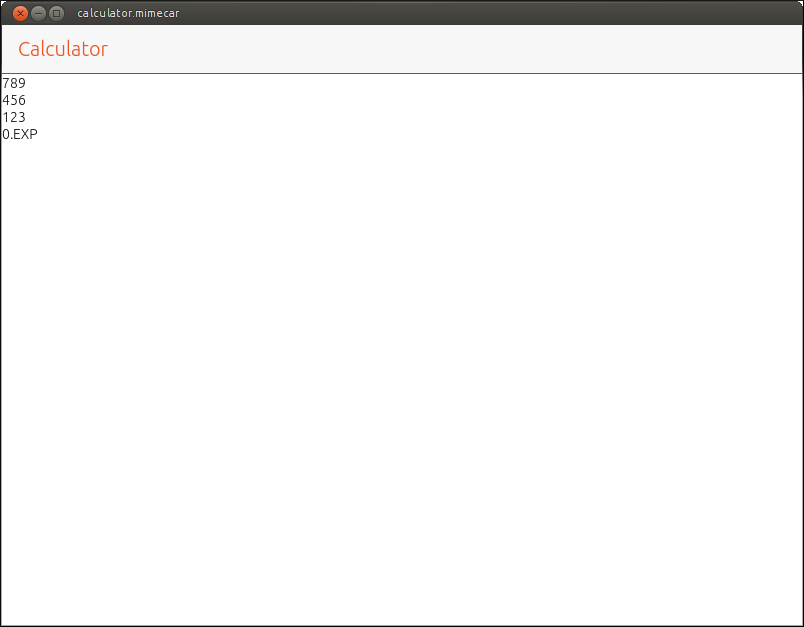
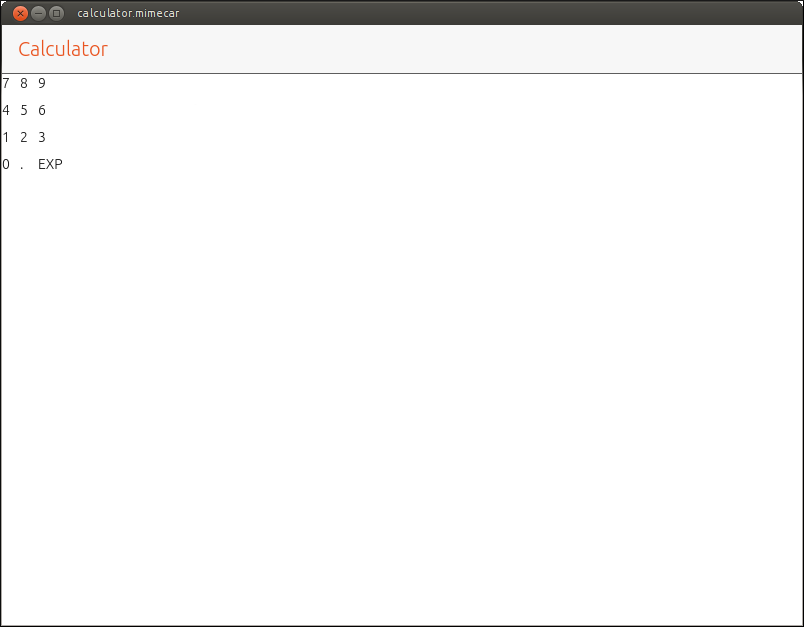
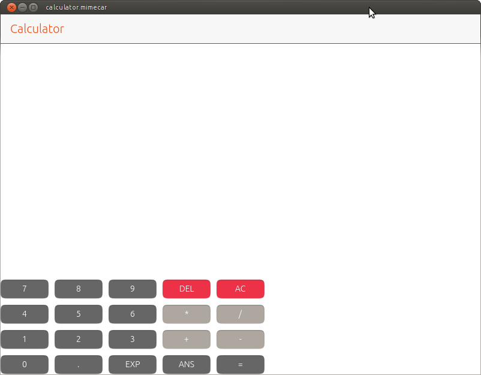

# Organizing components
In exercise 1 you had to distribute the calculator numbers in columns. To make the design of the calculator clearer, let’s add the distribution of the numbers in a table. I have added a couple of new texts to simplify the later development.

| Column 1 | Column 2 | Column 3 |
| --- | --- | --- |
| **7** | 8 | **9** |
| **4** | 5 | **6** |
| **1** | 2 | **3** |
| **0** | . | **EXP** |

This table has three columns. If the numbers are grouped into columns (as requested in the exercise) the result would be the one shown in the next image.


Source code:
```js
// First column
Column {

    anchors.top: pageHeader.bottom
    id: column1

    Label {
        text: "7"
    }

    Label {
        text: "4"
    }

    Label {
        text: "1"
    }

    Label {
        text: "0"
    }
}

// Second column
Column {

    anchors.top: column1.bottom

    id: column2

    Label {
        text: "8"
    }

    Label {
        text: "5"
    }

    Label {
        text: "2"
    }

    Label {
        text: "."
    }
}

// Third column
Column {

    anchors.top: column2.bottom
    id: column3

    Label {
        text: "9"
    }

    Label {
        text: "6"
    }

    Label {
        text: "3"
    }

    Label {
        text: "EXP"
    }

}
```

Unless you are programming a design calculator, the screen capture is different from the initial table. The columns are correct but they are distributed one underneath the other, not in parallel as they should. To distribute the numbers in a row you have to use the Row layout.


## The Row Layout
The Row layout works just like a Column element with a difference: the components are distributed in a row. The structure for this layout is as follows:

```js
Row {
  // Component

}
```

If the table is defined using only rows, all numbers would be distributed in a single row. To solve this problem we need to separate the table into rows and columns. The rows will contain the numbers horizontally, in four rows in total. The next step is to distribute the four rows in a column.




The source code is similar to the previous case. You just have to change the way in which the components are organized.
```js
// First column
Column {

    anchors.top: pageHeader.bottom
    id: column1

    // First row
    Row {

        Label {
            text: "7"
        }

        Label {
            text: "8"
        }

        Label {
            text: "9"
        }
    }

    // Second row
    Row {

        Label {
            text: "4"
        }

        Label {
            text: "5"
        }

        Label {
            text: "6"
        }
    }

    // Third row
    Row {

        Label {
            text: "1"
        }

        Label {
            text: "2"
        }

        Label {
            text: "3"
        }
    }

    // Fourth row
    Row {

        Label {
            text: "0"
        }

        Label {
            text: "."
        }

        Label {
            text: "EXP"
        }
    }
}
```

In this way the components are distributed as wanted. By separating the definition of rows and columns it is possible to have in one row 3 components and in another row, only one. If all rows in the table have the same number of elements you can use the Grid layout, which simplifies the QML code and gives us more flexibility.

## Grid Layout
This layout can be used if all rows and columns have the same number of components. The structure that follows is as shown:
```js
Grid {
  columns: 3

  // Components
}
```

The most important parameter is the number of columns. The layout distributes the components automatically using the number of columns as a limit. If you enter an extra component, it automatically adds a row and adds that component in the first column.




When defining a layout you can add a series of parameters that modify its behavior. In this case, only the number of columns is defined. As you can see in the code, it’s not defined how the components are distributed.

```js
Grid {

  anchors.top: pageHeader.bottom
  spacing: 10
  columns: 3

  // Row 1
  Label {
    text: "7"
  }

  Label {
    text: "8"
  }

  Label {
    text: "9"
  }

  // Row 2
  Label {
    text: "4"
  }

  Label {
    text: "5"
  }

  Label {
    text: "6"
  }

  // Row 3
  Label {
    text: "1"
  }

  Label {
    text: "2"
  }

  Label {
    text: "3"
  }

  // Row 4
  Label {
    text: "0"
  }

  Label {
    text: "."
  }

  Label {
    text: "EXP"
  }

}
```

# The Button

The label is a component that allows to display information to the user. The calculator that is being developed must allow the user to enter numbers and the operations to be performed with. To do this you have to use another component: the button.

A button has an associated text that tells the user the function it performs. When the user clicks or taps it, an action is generated that allows to execute an associated code. The button structure is a bit more complex than the label structure. We will learn it gradually.
```js
Button {
  text: "Text"
}
```

Based on the code that shows the labels in a grid, we need to make several changes:

* Replace the labels with buttons. To do this, it is enough to change the Label text by the object Button.
* Modify the anchor of the grid so that it is aligned at the bottom of the screen.
* Add two new columns to the table with the buttons shown in the image.


Source code:
```js
Grid {

    anchors.bottom: parent.bottom
    spacing: 10
    columns: 5

    // First row
    Button {
        text: "7"
    }

    Button {
        text: "8"
    }

    Button {
        text: "9"
    }

    Button {
        text: "DEL"
    }

    Button {
        text: "AC"
    }

    // Second row
    Button {
        text: "4"
    }

    Button {
        text: "5"
    }

    Button {
        text: "6"
    }

    Button {
        text: "*"
    }

    Button {
        text: "/"
    }

    // Third row
    Button {
        text: "1"
    }

    Button {
        text: "2"
    }

    Button {
        text: "3"
    }

    Button {
        text: "+"
    }

    Button {
        text: "-"
    }

    // Fourth row
    Button {
        text: "0"
    }

    Button {
        text: "."
    }

    Button {
        text: "EXP"
    }

    Button {
        text: "ANS"
    }

    Button {
        text: "="
    }
}
```

At this point, the application is starting to look like a calculator. There are two changes that would greatly improve its appearance though. The first is the colour of the buttons. The calculators have dark buttons and depending on the function, that colour varies. The second change is the size of the buttons. Do not forget that the calculator must work on a real device and normally the user fingers take up more space than the mouse pointer.

## Colour Settings
Ubuntu Touch has a series of colours defined in its palette. If they are used in the design of the user interface, the application will look integrated into the system. To define the background colour of a button, the colour property is used.
```js
Button {
  text: "8"
  color: UbuntuColors.graphite
}
```

You have to change the background colour of all buttons. The numbers should be dark gray. The operations a light gray and the buttons DEL and AC, reddish color. To complete the exercise you have to change the background color. It doesn’t matter if it doesn’t match the one on the screenshot.



Source code:
```js
Grid {

    anchors.bottom: parent.bottom
    spacing: 10
    columns: 5

    // First row
    Button {
        text: "7"
        color: UbuntuColors.graphite
    }

    Button {
        text: "8"
        color: UbuntuColors.graphite
    }

    Button {
        text: "9"
        color: UbuntuColors.graphite
    }

    Button {
        text: "DEL"
        color: UbuntuColors.red
    }

    Button {
        text: "AC"
        color: UbuntuColors.red
    }

    // Second row
    Button {
        text: "4"
        color: UbuntuColors.graphite
    }

    Button {
        text: "5"
        color: UbuntuColors.graphite
    }

    Button {
        text: "6"
        color: UbuntuColors.graphite
    }

    Button {
        text: "*"
        color: UbuntuColors.warmGrey
    }

    Button {
        text: "/"
        color: UbuntuColors.warmGrey
    }

    // Third row
    Button {
        text: "1"
        color: UbuntuColors.graphite
    }

    Button {
        text: "2"
        color: UbuntuColors.graphite
    }

    Button {
        text: "3"
        color: UbuntuColors.graphite
    }

    Button {
        text: "+"
        color: UbuntuColors.warmGrey
    }

    Button {
        text: "-"
        color: UbuntuColors.warmGrey
    }

    // Fourth row
    Button {
        text: "0"
        color: UbuntuColors.graphite
    }

    Button {
        text: "."
        color: UbuntuColors.graphite
    }

    Button {
        text: "EXP"
        color: UbuntuColors.graphite
    }

    Button {
        text: "ANS"
        color: UbuntuColors.graphite
    }

    Button {
        text: "="
        color: UbuntuColors.graphite
    }
}
```


## Changing the Button Size
The user interface of the calculator can be used on a computer. In a real device the buttons are too small. An important detail is that the interface has to adapt to the characteristics of each device. It is not the same to have a vertical mobile screen than having it horizontal.

For now, we will use a vertical screen in mind to design the app.
The buttons have two properties that allow you to define their vertical and horizontal sizes. The text of the button doesn’t automatically adapt to the size of the button so it will have to be adapted too. The button would have the following structure:
```js
Button {

  // Font size
  text: "7"
  font.pointSize: 17

  // Background color
  color: UbuntuColors.graphite

  // Button dimmensions
  width: buttonWidth
  height: buttonHeight

}
```

Repeat the same structure on all buttons. To make it easier to adjust the size of the buttons, we will define two variables. The variables are defined before the view (Page) and have the following structure:
```js
property real buttonWidth: units.gu(13)
property real buttonHeight: units.gu(7)
```

They are defined with the word 'property' to indicate that are a variable. 'Real' defines a number with decimals. Remember that the dimensions must be expressed in the form of GridUnits.

You need to adjust the size of the text and the dimensions of all buttons on the calculator. The result must be similar to the following:


Source code:
```js
Grid {

    anchors.bottom: parent.bottom
    anchors.left: parent.left
    anchors.right: parent.right

    spacing: 15
    columns: 5

    // First row
    Button {
        text: "7"

        font.pointSize: 17
        color: UbuntuColors.graphite

        width: buttonWidth
        height: buttonHeight
    }

    Button {
        text: "8"

        font.pointSize: 17
        color: UbuntuColors.graphite

        width: buttonWidth
        height: buttonHeight
    }

    Button {
        text: "9"

        font.pointSize: 17
        color: UbuntuColors.graphite

        width: buttonWidth
        height: buttonHeight
    }

    Button {
        text: "DEL"

        font.pointSize: 17
        color: UbuntuColors.red

        width: buttonWidth
        height: buttonHeight
    }

    Button {
        text: "AC"

        font.pointSize: 17
        color: UbuntuColors.red

        width: buttonWidth
        height: buttonHeight
    }

    // Second row
    Button {
        text: "4"

        font.pointSize: 17
        color: UbuntuColors.graphite

        width: buttonWidth
        height: buttonHeight
    }

    Button {
        text: "5"

        font.pointSize: 17
        color: UbuntuColors.graphite

        width: buttonWidth
        height: buttonHeight
    }

    Button {
        text: "6"

        font.pointSize: 17
        color: UbuntuColors.graphite

        width: buttonWidth
        height: buttonHeight
    }

    Button {
        text: "*"

        font.pointSize: 17
        color: UbuntuColors.warmGrey

        width: buttonWidth
        height: buttonHeight
    }

    Button {
        text: "/"

        font.pointSize: 17
        color: UbuntuColors.warmGrey

        width: buttonWidth
        height: buttonHeight
    }

    // Third row
    Button {
        text: "1"

        font.pointSize: 17
        color: UbuntuColors.graphite

        width: buttonWidth
        height: buttonHeight
    }

    Button {
        text: "2"

        font.pointSize: 17
        color: UbuntuColors.graphite

        width: buttonWidth
        height: buttonHeight
    }

    Button {
        text: "3"

        font.pointSize: 17
        color: UbuntuColors.graphite

        width: buttonWidth
        height: buttonHeight
    }

    Button {
        text: "+"

        font.pointSize: 17
        color: UbuntuColors.warmGrey

        width: buttonWidth
        height: buttonHeight
    }

    Button {
        text: "-"

        font.pointSize: 17
        color: UbuntuColors.warmGrey

        width: buttonWidth
        height: buttonHeight
    }

    // Fourth row
    Button {
        text: "0"

        font.pointSize: 17
        color: UbuntuColors.graphite

        width: buttonWidth
        height: buttonHeight
    }

    Button {
        text: "."

        font.pointSize: 17
        color: UbuntuColors.graphite

        width: buttonWidth
        height: buttonHeight
    }

    Button {
        text: "EXP"

        font.pointSize: 17
        color: UbuntuColors.graphite

        width: buttonWidth
        height: buttonHeight
    }

    Button {
        text: "ANS"

        font.pointSize: 17
        color: UbuntuColors.graphite

        width: buttonWidth
        height: buttonHeight
    }

    Button {
        text: "="

        font.pointSize: 17
        color: UbuntuColors.graphite

        width: buttonWidth
        height: buttonHeight
    }
}
```

This chapter ends with this example. The next step is to add a label at the top of the screen to show the operations and their result.

# People who have collaborated
* Larrea Mikel: revision of the chapter in Spanish.
* Cesar Herrera: revision of the English translation.
* Joan CiberSheep: revision of the English translation.
