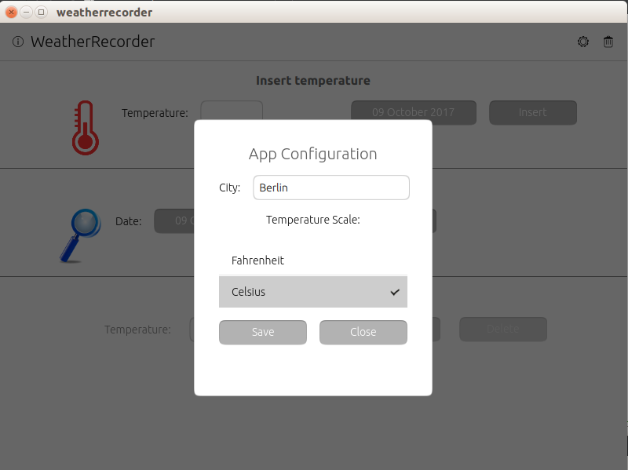

# Database access with QML

This chapter will show how to access to a *SQLite* database from a *QML* + JavaScript application. *SQLite* is the database used by *Ubuntu Touch (UBports)* (and other mobile devices). For more informations about SQLite see its [website](https://www.sqlite.org/) and the links proposed at the end of the chapter.

The prerequisites necessary to understand this tutorial are a knowledge of QML, JavaScript, Ubuntu Touch SDK with his IDE and a base SQL language knowledge. If you don’t have that prerequisites you are invited to read the dedicated sections of the QML course and the suggested tutorial at the end of the chapter.

**Premise**: for the database access will be used *QtQuick.LocalStorage* object (provided by QT library), and not *U1Db-QT* (the QML module created by [Canonical](https://docs.ubuntu.com/phone/en/apps/api-qml-development/U1db.tutorial)). This choice is due to the fact that *U1Db-QT* currently seems incomplete and not flexible like the JavaScript solution.

# Introduction

In this chapter we’ll be showed a custom QML application to provide examples of the common operations performed on a database: Create, Research, Update, Delete (ie: a C.R.U.D. application). That sample application will have a basic user interface (our focus is on the database access part) and don’t have an important real use; was chosen and created only for his didactic relevancy.

**Note:** This chapter don’t cover the steps necessary to package, test and deploy the application (will be the focus of next chapters).

# The sample application: functional presentation

The application that we are going to describe is a "weather temperature recorder". Using it, the user can insert the daily temperature value of his favourite city and manage the saved ones: update, delete or search them. At first start-up, the application must provide default configuration values for the target city and the temperature unit (ie: Celsius or Fahrenheit degree). The user can accept the proposed values or insert custom ones (the saved configuration can be updated later if the user want do it).

Each day the user can insert *only* one temperature value. Saved values can be searched by date. If a value is found, is possible modify or delete it. Is also possible execute a batch deletion of all the saved temperature values. The application must provide a validation system to prevent invalid insert, like empty or not numeric values.

Let’s start:

1. Set-up the Ubuntu IDE and SDK as described at the beginning of this course creating at least a "Desktop" kit.
2. Download and import our sample project (named “WeatherRecorder”) in the Ubuntu IDE (File → Open File or Project... → choose the folder containing the file ‘WeatherRecorder.pro’)

During the import, Ubuntu SDK ask to choose the "Target kits" for the project (ie: the platform where the application will be executed). We want run our project form the IDE, so that is necessary flag an existing "Desktop Kit" or create a new one. You can find more details about "Kit" at the beginning of this course.

At the end of import process, expand the nodes in "Projects" view. The structure must be like the following one:


Feel free to open and explore any files and study the project structure before continue. Before concentrate our attention on the database access, we want provide some background informations that could be useful for the future.

The entry point of a QML application is the *Main.qml* file, it contains the code that create and start the full application. Running for the first time our application (press the green "Play" icon of Ubuntu SDK) is shown a configuration dialogue filled with default values. If you like them, press "Save" button, otherwise modify them before save.

The following image display the configuration page shown at first start-up:


Let’s see more details about what happen when the application starts. If you open the *Main.qml* file you can find this code (you can use CTRL+ F to perform a search):

```js
Component.onCompleted: {
	//some code... omitted for shortness
}
```

All the code placed inside that block will be executed when the event *onCompleted* is raised. In this case each time the application starts, because the above code is placed inside the *QML* Page component. But, the *onComplete* event is raised for any other component, so that can be used to initialize it instead of the application.

For example:

```js
Label{
	id:myLabel
	width: units.gu(10)
	Component.onCompleted: {
		myLabel.text = /* get his value from the database */
	}
}
```
When the *onComplete* event of the Label component is raised (ie: when is drawn), is executed the code that initialize the Label (e.g. loading the text to display from a database or other source). In general, the *onComplete* event is used to perform some initialization tasks at application or single component level.

In our specific case, at *onComplete* event of the application, are performed two operations:

1. Database and tables creation (we’ll talk about that in the next section).
2. Inserted default values (ie: the ones shown in the configuration dialogue shown at first start-up).

Now, someone could say: "...we don’t want perform that operations at each application start !" Right, to prevent this, the solution adopted is the use of *Settings* component. It provides persistent application settings (ie. user preferences or other customizations to be persisted on a configuration file).

In our *Main.qml* we have:

```js
Settings {
	id:settings
	/* flag to show or not the App configuration pop-up */
	property bool isFirstUse : true;
}
```

It declare a boolean property named *isFirstUse* initialized to *true*. After the first initialization operations, inside the *onComplete* management block, is set to *false*. With this solution, next time the configuration dialogue will be not shown and the database initialization will be skipped.

To distinguish the first start form the other ones, we use an *if* check, so that the decision logic is the following:

```js
Component.onCompleted: {
	if(settings.isFirstUse)
	{
		//create database, insert default data
	}else{
		//if necessary do something else
	}
}
```

But, where are saved the Setting values (ie: our "isFirstuse" flag)? They are saved in a .conf file placed in that folder:

```bash
~userHome/.config/<applicationName>/<applicationName>.conf
```

In our case <applicationName> is *weatherrecorder* (is the value assigned at the parameter "applicationName" in *Main.qml*). Feel free to open that file, is a simple text. Removing it, or setting to *true* our flag value, at the next application start will be executed the initialization operations (try it if you want).

Also, note that in the project sources there is a file named *Settings.qml*. It must contains all the flags/variable to be stored in the *weatherrecorder.conf* file. The *Settings* component can be used to implements any other logic, not only for the use case described here.

After the configuration saving the home page of the application is the following:


The user interface and his use is quite simple, so that we omit his description. Before continue we suggest to try it to get more confidence with the application behaviour. Just some notes about the header bar of the application that could be useful for future applications. We can see two "action" bars: one in the upper right corner and another in the upper left one.

The left one is named *leadingActionBar*, the one on the right is named *trailingActionBar*. Look in the Main.qml source code and his code comments to know how are implemented (perform a search in that file with a CTRL+F).

In the next sections, we’ll look at the chapter focus: the database access from a QML + JavaScript application.

# Introduction at the Database access

As said before, we don’t use *U1Db-QT* API but QtQuick.LocalStorage object to perform the database access. The database type used by *Ubuntu Touch (Ubports)* is [SQLite](https://www.sqlite.org) a file based database that support SQL as query language. To use it from a *QML* application are not necessary installations or configurations: everything is provided by *QML* and *Ubuntu SDK*.

Our database access logic is contained in the file named Storage.js (there is no naming convention for that file, you can use another one or use DAO pattern if you prefer). The following examples are taken from that file.

The *QtQuick.LocalStorage* module must be imported in any *QML* file that need it, using this statement:
```js
import QtQuick.LocalStorage 2.0
```

Is also necessary import the JavaScript file containing the database access functions (Storage.js in our case):

```js
import "Storage.js" as Storage
```

This is the import syntax to use any JavaScript from QML file, not only for our sample. To invoke the functions contained in *Storage.js* is used the declared alias *Storage*. Is suggested use a name similar at the JavaScript file for the alias. Remember that alias names MUST have the first letter in upper Case.

# The Database interaction

Follow the description of the database operations performed by our application (see *Storage.js* file for the full code).

## Database and table(s) creation

In any *QML* application that need a database, the first operation to be performed is the database and table(s) creation. This operations (like any others) require a connection at the physical database. The connection is created with the *QTquick.LocalStorage* object and usually is a best practice create an utility JavaScript function that return a reference to it, like this:

```js
function getDatabase() {
	return LocalStorage.openDatabaseSync("weatherRecorder_db", "1.0", "StorageDatabase", 1000000);
}
```

For more details about the API *openDatabaseSync* parameters see: http://doc.qt.io/archives/qt-5.5/qtquick-localstorage-qmlmodule.html (we omit it for shortness). Before perform any database operation is necessary obtain a connection with it. For this purpose, the above function can be re-used in any other JavaScript function that need the database (See *Storage.js* file).

When a connection is obtained, is possible execute a database *SQL* query. Note: Database connections are automatically closed during JavaScript garbage collection (a cleaning process executed by JavaScript engine to free memory).

Let’s see the database table creation code (we omit the full code to have a compact view. See the source file for details):

```js
/* create the necessary tables */
function createTables() {
	var db = getDatabase();
	db.transaction(
        function(tx) {
            tx.executeSql(' < SQL Create statement 1 > ');
            tx.executeSql(' < SQL Create statement 2 > ');
        });
}
```

Note: as first thing, is called the *getDatabase()* function the return a database connection. Like the above code, each time we need to perform a database query (ie any C.R.U.D. operation) is necessary open a transaction that is passed at the callback function containing the *SQL* statements to run.

If the callback function throws exceptions (ie: an error), the transaction is rolled back (a ‘transaction’ is a set of operations that must be executed with success, if one of them fails is executed an undo to restore the status before the execution).

For our example application, in the *createTables()* function are created two tables: one to store temperature values and one for the configuration parameters. No foreign keys are used.

For *configuration* table the creation SQL code is:
```sql
CREATE TABLE IF NOT EXISTS configuration(id INTEGER PRIMARY KEY AUTOINCREMENT,
	param_name TEXT, param_value TEXT)
```

For *temperature* table is:
```sql
CREATE TABLE IF NOT EXISTS temperature(id INTEGER PRIMARY KEY AUTOINCREMENT, date TEXT, temperature_value REAL)
```

(The above code is the one placed inside the < SQL Create statement > placeholder).

Obviously, the declared data-type of the table columns are the ones supported by *SQLite* database (the type "date" is not supported, so that is declared as TEXT). Note the use of a field named "id" and marked as Primary key (PK) in the two tables.

That field is flagged as *AUTOINCREMENT* so that each time a new record is inserted in the table his value is automatically incremented by SQLite. The use of an "autoincrement" field as PK is not mandatory if there are field(s) that can identify only one record in the table (we choose to use it to provide a further useful feature of SQLite).

After the execution of *createTables()* function the *SQLite* database file is created and two tables are inserted.

We have said that *SQLite* is a file based database; but, where are placed our database files? The location depends on the application name. The general full path is:
```bash
/<home-folder>/.local/share/<applicationName>/Databases/
```

where <applicationName> is the values provided in the *applicationName* parameter in *Main.qml*:

```js
applicationName: "weatherrecorder"
```

So that, our database is placed at:
```bash
/<home-folder>/.local/share/weatherrecorder/Databases/
```

On *Ubuntu Touch* (UBports) systems *<home-folder>* is */home/phablet/* on Desktop systems replace ‘phablet’ with the name of the logged in user (type the command *whoami* in a shell to know his name if you are not sure).

That folder contains two files: a *.sqlite* and a *.ini* one. The database file is the one with *.sqlite* extension (the name is an unique id created by *QTQuick.LocalStorage*). The *.ini* file is a file descriptor associated at the *.sqlite* one. Don’t worry about their strange names, is not necessary remember or manage them.

To see our two tables and perform *SQL* query, open the *.sqlite* file with a graphic interface like [Sqliteman](https://sourceforge.net/projects/sqliteman/) available in the "Ubuntu software Center".

If you open the database file with *Sqliteman* you got a view like this one:


On the left side we can see the tables found in the database ("configuration" and "temperature") with their columns. In the upper right text area we can execute some *SQL* statements. For example, write this one and press the *Play* icon in the menu bar:

```sql
select * from configuration;
```

The result is the content of the *configuration* table (ie: our configuration parameters provided at the first application start-up). If you right click on table name is possible perform some administration tasks on the table (add or edit column, delete the table and so on).

Obviously any modification made with *Sqliteman* affect the application that uses the database (e.g.: if a table is dropped our application will crash because is necessary modify the application).

In *QML* + *JavaScript* development, *Sqliteman* (or any other similar tools) is used only for checks purpose, like running SQL extraction statements or data insertion/editing. For example to insert sample data or correct wrong ones. We’ll talk about *SQL* statements in the next sections.

## Research operation

With a research operation we look inside the database table(s) for a specific record(s) matching some search criteria. That operation is done with a *SQL select* query that return a set of zero or N table rows matching the criteria (for us *record* and *table row* are synonym). The returned *set* is usually identified with the *result-set* name.

An example of research, can be found in the function named *getTemperatureValueByDate* in *Storage.js* file. That function is invoked when the user perform a search operation in the user interface passing as input the date for which want to know the temperature value.

Here the JavaScript function that perform the search:

```js
function getTemperatureValueByDate(date){

	var db = getDatabase();
	var targetDate = new Date (date);

	/* return a formatted date like: 2017-04-30 (yyyy-mm-dd) */
	var fullTargetDate = DateUtils.formatDateToString(targetDate);
	var rs = "";

    db.transaction(function(tx) {
       rs = tx.executeSql("SELECT temperature_value FROM temperature t where date(t.date) = date('"+fullTargetDate+"')");
       } );

    /* check if value is missing or not */
    if (rs.rows.length > 0) {
        return rs.rows.item(0).temperature_value;
    } else {
        return "N/A";
    }
}
```

Note at the beginning the *getDatabase()* function (described in the previous section) and how we can invoke functions contained in another JavaScript file (look at the statement DateUtils.formatDateToString(targetDate); ). The technique adopted to execute a *SQL* query is the same used for the table creation: create a transaction and inside the callback function insert SQL statements.

The above example show how to manage the results returned by the *SQL* query. Is used a JavaScript variable named *rs* that act as an handle to the result-set informations. The access at the records/rows must be performed with the built-in field named *rows* (a keyword name). It is a pointer at the set of returned records used to access at a specific one or iterate over all the records).

For example:
```js
rs.rows.item(0).temperature_value;
```
get access only at the *first* record of the returned result-set (note: the count is zero-based) and from it take the value of table column *temperature_value*. We can do that because we have executed a *select* query; using other SQL statements (see following sections) the returned information will not be a set of table records but a simple number.

To iterate over the full result-set records, for example to print the *temperature_value*, this JavaScript code must be used:

```js
for(var i = 0; i < rs.rows.length; i++) {
	console.log("Temperature found:"+ rs.rows.item(i).temperature_value);
}
```

where *console* is a built-in object used to print messages on the console (is similar at System.out.println("a message") in Java).

## Update operation

The update operation is performed with a *SQL update* query. An example of update is the *updateTemperature* JavaScript function used to update an already stored temperature value.

```js
function updateTemperature(date,tempValue){
	var db = getDatabase();
	var fullDate = new Date (date);

	/* return a formatted date like: 2017-09-30 (yyyy-mm-dd) */
	var dateFormatted = DateUtils.formatDateToString(fullDate);
	var res = "";
	db.transaction(function(tx) {

        var rs = tx.executeSql('UPDATE temperature SET temperature_value=?WHERE date=?;', [tempValue,dateFormatted]);

        if (rs.rowsAffected > 0) {
            res = "OK";
        } else {
            res = "KO";
        }
    }
);
return res;
}
```

In the above example is shown another use of the query result-set. The returned value is a number NOT a set of record(s), due to the facts that we have executed an *SQL* update query that return only the number of table row(s) updated. That value is contained in the field named *rowsAffected* (is a fix name you can’t change it). The above JavaScript function return a string message whose value depends on *rowsAffected* value. Is also possible return the *rowsAffected* value without any decision logic; the choice depends on the logic to implement.

## Insert operation

To insert a new record/row in a table is used a *SQL insert* statement. In our use case we perform that operation when a new temperature value is inserted:

```js
/* Insert a new temperature value in the give date */
function insertTemperature(date,tempValue){
	var db = getDatabase();
	var fullDate = new Date (date);
	var res = "";
	var dateFormatted = DateUtils.formatDateToString(fullDate);

	db.transaction(function(tx) {
		var rs = tx.executeSql('INSERT INTO temperature (date, temperature_value) VALUES (?,?);', [dateFormatted, tempValue]);

        if (rs.rowsAffected > 0) {
	        res = "OK";
        } else {
    	    res = "Error";
        }
	});

	return res;
}
```

The logic and the returned value are similar at the update operation, except for the *SQL* statement executed.

## Delete operation

The last operation that can be performed is the the *delete* one. For example, this operation is executed when the user want delete all the saved temperature values, pressing the *trash* icon in the menu bar. This is the JavaScript function used:

```js
/* Remove ALL the saved Temperature values NOT the tables. Return the number of rows
deleted */
function deleteAllTemperatureValues(){
	var db = getDatabase();
	var rs;
	db.transaction(function(tx) {
		rs = tx.executeSql('DELETE FROM temperature;');
	});

	return rs.rowsAffected;
}
```

In this case we want to mark that *rowsAffected* is the number of deleted table rows and that value is returned by the JavaScript function, without any decision logic. For example, the caller of the function can assign it to a *QML* Label component to be displayed or use it for a different purpose.

# Conclusions

We have shown how to create from scratch a *SQLite* database and how to insert and retrieve data using *QML* + *JavaScript*. Also was demonstrated how can be used the *onComplete* event and how to save user preferences or custom values with the *Settings* object. The provided sample code and the solutions proposed can be reused as base for a custom application or improve the sample one.

We invite to modify the source code to clarify some possible doubts (this is the best solution to understand and improve your knowledge). Also, take a look at the comments placed inside the source code.

In the next chapter we’ll talk about charts. We will see how to create a chart displaying our saved temperature values using *QChats.js* library.

# References
Here some link to deepen some arguments introduced in this chapter:
* For *SQL* language: https://www.w3schools.com/sql/sql_intro.asp only the syntax for the base statements: insert, update, delete, select, create.
* For *SQLite*: http://www.sqlitetutorial.net/
* For *QML* API: https://docs.ubuntu.com/phone/en/apps/qml/index the official reference for Ubuntu Touch documentation.

# People who have collaborated
* Fulvio Russo: author
* Miguel Menéndez: revision of the chapter in English. Translation into Spanish.
