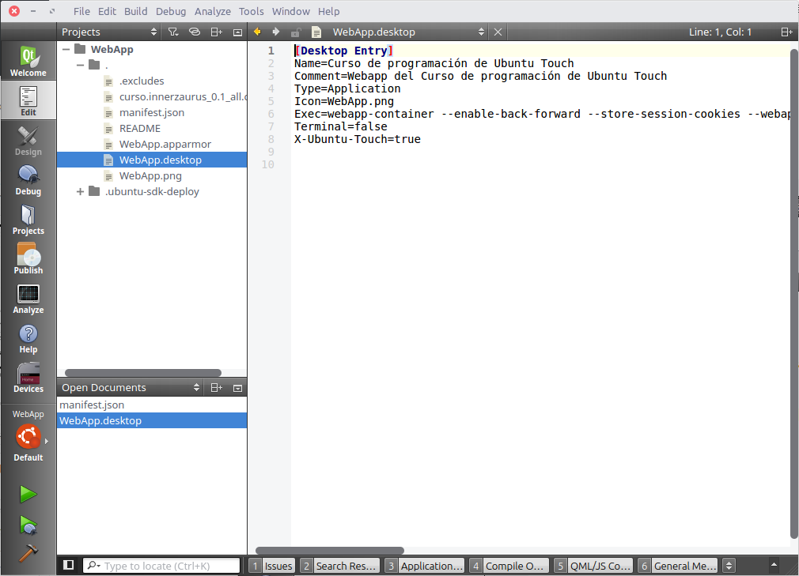
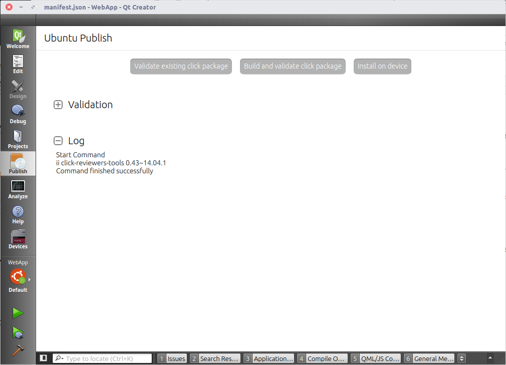
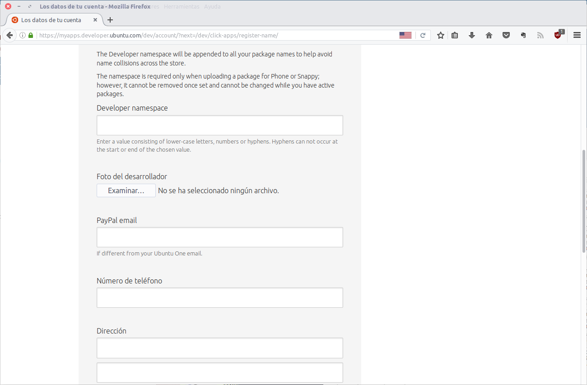
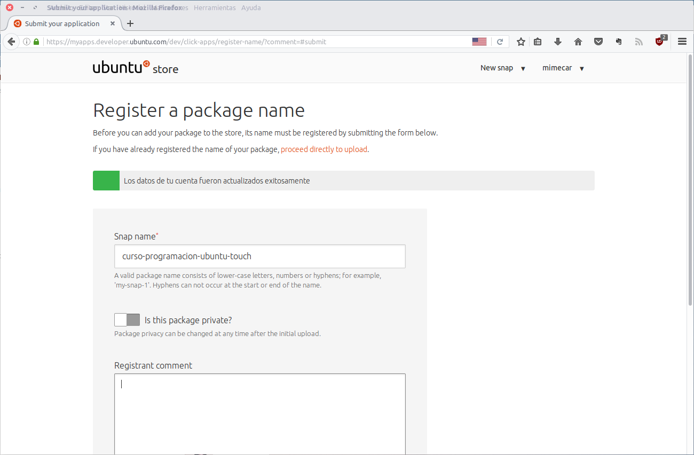
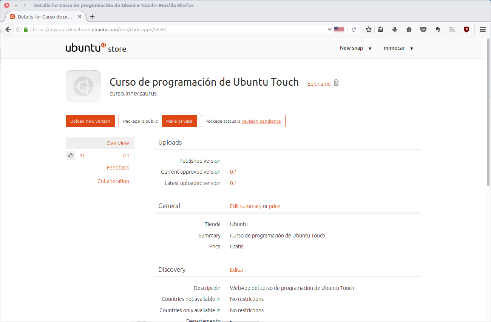
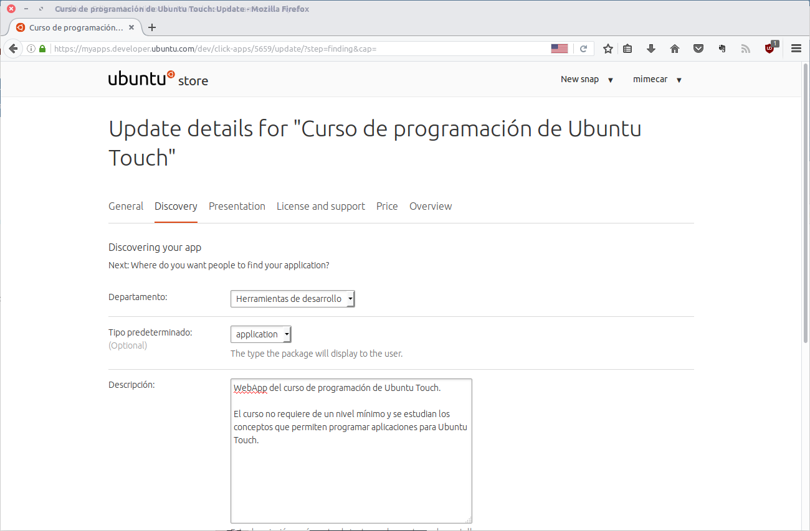
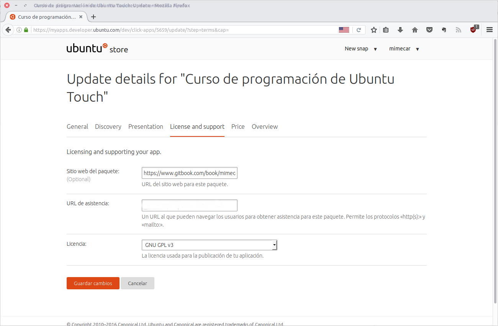
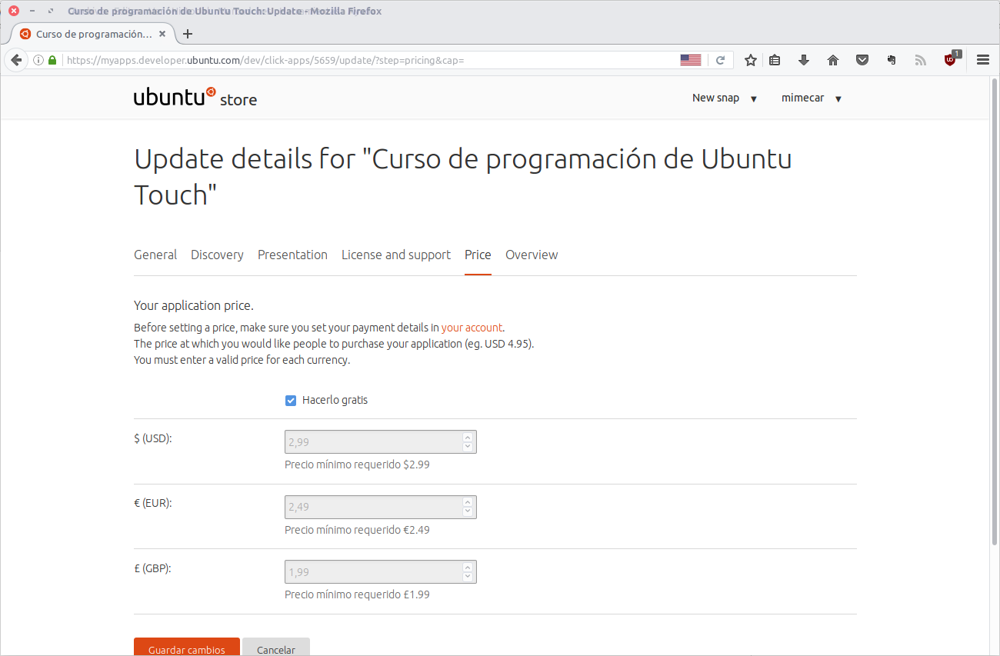

# chapter-03-webapp

## Introducción

En este capítulo se estudiará la creación de una Web App pasando por todas las fases del proceso y finalizando con la creación de un paquete click para Ubuntu Touch. Ese paquete se subirá a la tienda de Ubuntu para que esté accesible para todos los usuarios. Como requisito previo a este capítulo es necesario tener instalado el SDK de Ubuntu y haber completado las aplicaciones de ejemplo del capítulo anterior.

## Web App, también conocida como Aplicación Web

### ¿Qué es una Web App?

Una Web App es un tipo de aplicación de Ubuntu Touch. Su funcionamiento es simple y consiste en mostrar una página Web como si fuera una aplicación independiente. Como aplicación aparece en el scope de aplicaciones y se puede gestionar desde la tienda de Ubuntu. Posiblemente os preguntéis que sentido tiene mostrar una página Web si el navegador ya lo hace de forma nativa.

Internamente el navegador y una Web App comparten la misma base. La diferencia es que la Web App está aislada y no comparte información con el navegador. Otra diferencia es que el usuario no puede cambiar la Web de la Web App ya que en caso de hacerlo se abre el navegador nativo. Al ser aplicaciones que obtienen el contenido de Internet tienen limitaciones a la hora de acceder a los recursos del teléfono. Si necesitamos acceder a esos recursos tendríamos que recurrir a una aplicación nativa usando HTML5 entre otros lenguajes.

A nivel de programación la Web App es el tipo de aplicación más sencillo que podemos encontrar. La programación se reduce básicamente a poner las URL en las que trabaja y seleccionar los datos que se muestran como aplicación. No tiene más complejidad y el SDK hace todo el trabajo por nosotros. Para distribuir la Web App es necesario empaquetarla en un paquete click que se podrá subir a la tienda de Ubuntu. Si subimos la Wep App a la tienda de Ubuntu se añade de forma automático a [uApp Explorer](https://uappexplorer.com/apps?type=webapp).

### Creación del proyecto

Para crear un proyecto nuevo pulsamos en el botón New Project, Otra forma de hacerlo es desde el menú File, New File or Project.

Nos aparecerá una ventana con los tipos de proyectos que podemos usar. Seleccionamos Web App. Como se muestra en la descripción es un proyecto independiente de la plataforma y con limitaciones en el acceso a los recursos.

Seleccionamos la ruta en la que se guardará el proyecto. Recordad que no se pueden usar espacios o caracteres con acentos.

Escribimos los datos de la aplicación.

Seleccionamos los Kits que usaremos. Como nos interesa generar un ejecutable para ordenador \(Desktop\) y para dispositivo \(Ubuntu\) dejamos marcados los dos. El kit Desktop tiene que aparecer siempre. Si no lo hace será necesario reiniciar la configuración de ubuntu-sdk-ide.

En el último paso se muestra un resumen. Fijaros que me aparece por defecto el control de versiones Bazaar. Si el proyecto se guarda en una carpeta que está bajo un control de versiones, éste se configura de forma automática.

Ya hemos acabado el asistente. El proyecto se abre de forma automática.

### Estructura del proyecto

El proyecto de una Web App es muy sencillo y consta de varios archivos.

* _.excludes_: extensiones y carpetas que se quedan fuera del control de versiones.

* _manifest.json:_ contiene la información de la aplicación que se mostrará al usuario. Este archivo se procesa de forma automática cuando subimos el proyecto a la tienda de Ubuntu. Todas las aplicaciones tienen un nombre asociado que se añade a todos los paquetes y evita que aparezcan colisiones en el nombre \(tiene que ser único\). Después del nombre de la aplicación tiene que aparecer el nombre.

* _WebApp.apparmor:_ permisos de la aplicación.

* _WebApp.desktop:_ información para lanzar la aplicación en el scope de aplicaciones.

* _WebApp.png:_ icono de la aplicación.

### Modificaciones

Hay que hacer tres modificaciones a la plantilla que nos proporciona el SDK de Ubuntu Touch. La primera es cambiar la URL que se abre en el archivo WebApp.desktop. El texto que hay que cambiar es la URL que se muestra en la línea Exec. Las URL que estén dentro del mismo dominio aparecerán en la Web App. Si pulsamos sobre un enlace que va a otro dominio se abrirá el navegador Web.

`Exec=webapp-container --enable-back-forward --store-session-cookies --webappUrlPatterns=https?://m.WebApp.com/* http://m.WebApp.com %u`

El siguiente paso es sustituir el archivo del icono \(WebApp.png\) por una imagen PNG que queramos. La resolución tiene que ser de 256x256. Por último abrimos el archivo manifest.json y completamos la información de la aplicación.

### Pruebas de la WebApp

Pulsamos en el botón Play para lanzar la aplicación en el escritorio. Por defecto está seleccionado el kit Desktop. Esta aplicación tiene un bug del que me avisaron cuando ya la había publicado. En el archivo WebApp.desktop hemos definido las URL en las que trabajará la aplicación. El problema es que para acceder al contenido del libro accedemos a un dominio diferente por lo que se abre el navegador Web. Tenemos dos opciones. La primera es añadir el nuevo dominio a la lista de URL permitidas mientras que la segunda es poner directamente esa URL. Usaré la segunda opción.

Si seleccionamos el kit de Ubuntu podremos ver el resultado en el dispositivo que tengamos. Es importante que el círculo que hay al lado del Kit de Ubuntu esté en verde. En caso contrario no tenemos conexión con el dispositivo.

## Creación del paquete click

La Web App funciona en el dispositivo pero sólo mientras está conectado al ordenador. Para que se quede de forma permanente es necesario instalarla en el sistema usando un paquete click. Pulsamos en el botón Build and validate click package.

Si no aparece ningún problema pulsamos en el botón Install on device. Es posible que nos da un problema de conexión tenemos que ir a Devices, seleccionar el dispositivo y en el apartado Control pulsar en el botón Open SSH connection to the device.

El resultado es la aplicación instalada en el dispositivo.

La Web App está finalizada.

## Publicar la aplicación

Para publicar una aplicación a la tienda es necesario tener una cuenta de LaunchPad. Cualquier usuario que tenga Ubuntu Touch ya la tiene creada para poder acceder a la tienda de Ubuntu. Abrimos la tienda pulsando en el enlace [https://developer.ubuntu.com/en/publish/](https://developer.ubuntu.com/en/publish/)

Pulsamos en el enlace y accederemos al panel de control.

El primer paso es rellenar los datos del usuario. La única información obligatoria es el país del usuario. Este campo se usa para calcular el IVA de las aplicaciones de pago.

Las aplicaciones tienen que tener un nombre del que tengamos permisos de uso. Por ejemplo, si llamamos a nuestra aplicación Angry Birds posiblemente tengamos problemas con los creadores de la franquicia.

Ya el último paso consiste en seleccionar el paquete click que hemos creado y definir las características de la aplicación. El canal o la serie se utilizan como filtros para mostrar las aplicaciones en la tienda.

Si no aparece ningún problema ya tenemos la aplicación preparada para publicar. Antes de hacerlo os recomiendo rellenar la información asociada a la aplicación ya que facilitará a los usuarios el uso de la aplicación. Pulsamos en el enlace Edit summary or price.

En la pestaña General definimos el nombre de la aplicación y escribimos un resumen de una línea.

La aplicación se tiene que clasificar en una categoría. También se añade en este punto una descripción detallada que informe de lo que hace la aplicación.

En Presentation se elige el icono de la aplicación que se mostrará en la tienda. Si tenemos capturas de pantalla es aconsejable subirlas para que el usuario tenga una noción de la aplicación antes de instalarla.

Si el usuario encuentra algún bug o quiere ponerse en contacto con nosotros usará la información que se muestra en la pestaña License and support.

Software libre no implica software gratuito. Es posible ponerle un precio a la aplicación y que los usuarios tengan que pagar dinero para descargarla.

Guardamos los campos y vemos como cambia la ficha de la aplicación. En este momento ya se puede publicar la aplicación.

El tiempo que tarda en aparecer en la tienda es variable. Cuando aparezca sólo tenemos que buscar la aplicación por el nombre.

La aplicación también aparece en uApp de forma automática.

## Conclusiones

Una Web App es muy sencilla de programar. Realmente es seguir el asistente del SDK de Ubuntu y hacer un par de cambios que la adapten a nuestras necesidades. Esa Web App es temporal y cuando desconectemos el dispositivo que use Ubuntu Touch del ordenador desaparecerá. Para dejarla fija es necesario crear un paquete click e instalarlo. Si queremos compartir la aplicación con otros usuarios es necesario usar la tienda de Ubuntu. El proceso de publicación no es complejo y permite que cualquier usuario del mundo descargue la aplicación.

## Referencias

[WebApp tutorial](https://developer.ubuntu.com/en/phone/web/tutorials/web-app-tutorial/)

