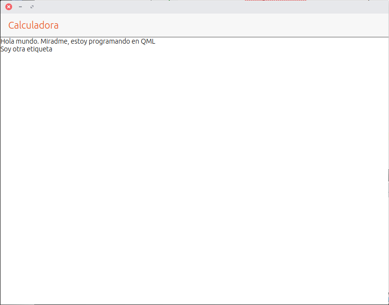

# chapter-04-s01

## Introducción al lenguaje QML

QML es un lenguaje que toma como base JavaScript y se utiliza para crear el interfaz de usuario de una aplicación. Permite usar tanto elementos tradicionales \(botones, listas, etc.\) como elementos gráficos a los que se le añade lógica. Como ejemplo del primer caso está el interfaz de usuario de Ubuntu Touch. Para el segundo caso hay varios [ejemplos en la Web de QT.](https://www.qt.io/ui/) QML se encarga de la visualización pero no de la lógica que implementa la aplicación.

Esa lógica se puede escribir en varios lenguajes, dependiendo de las necesidades que tengamos. Si la aplicación es un juego y necesita potencia de cálculo el lenguaje elegido sería C/C++. En cambio, si no realiza tareas que sean críticas en el tiempo se puede usar JavaScript. De momento las aplicaciones del curso usarán JavaScript y más adelante se pasará a C/C++.

**Creación del proyecto** La configuración del proyecto tiene que ser la siguiente:

* Tipo de proyecto: QML App with Simple UI \(qmake\).
* Kits: hay que seleccionar todos los kits instalados.

El proyecto se creará con la plantilla elegida y se abrirá por defecto el archivo del interfaz de usuario \(QML\). 

La estructura que tiene el proyecto varía un poco respecto a la que tenía la Web App. 

En negrita aparecen marcados los archivos que se pueden modificar. El resto de archivos es de uso interno del IDE y no conviene modificarlos.

* Calculadora.pro: archivo principal del proyecto.
* Calculadora
  * Calculadora.pro: información para el compilador.
  * QML
    * tests/unit: los archivos de esta carpeta se usan para hacer validaciones de la aplicación.
    * **Main.qml:** archivo que contiene el interfaz de usuario de una pantalla.
  * Other files
    * tests/autopilot: los archivos de esta carpeta se utilizan para ejecutar la aplicación.
    * **Calculadora.apparmor:** permisos de la aplicación
    * **Calculadora.desktop:** información de la aplicación para el lanzador de aplicaciones.
    * **Calculadora.png:** icono de la aplicación.
* Other files
  * **manifest.json.in:** información para la tienda de Ubuntu con los datos de la aplicación.

El entorno de desarrollo tiene una pestaña que pone **Design**. Esa pestaña analiza el código QML generado y lo convierte en el interfaz de usuario. La herramienta no funciona bien y da errores aunque el código QML sea válido. Lo podéis ver en la pantalla del proyecto con las palabras que están marcadas en rojo en las líneas 23, 24 y 25. Por esta razón las pruebas del interfaz de usuario se realizarán ejecutando la aplicación en el ordenador.

## Estructura del archivo QML

Todos los archivos QML tienen una estructura común que se verá a continuación. En negrita está el código fuente y la explicación está como texto normal.

QML permite usar una serie de componentes que ya están definidos. Esta información se le pasa al proyecto con la sentencia import. Es posible usar diferentes versiones de los componentes aunque lo normal sería elegir la última versión disponible.

```javascript
import QtQuick 2.4
import Ubuntu.Components 1.3
```

Los comentarios son guías que escribe el programador sobre partes concretas del código. Os recomiendo escribir comentarios en las partes de código que sean complejas. Una cosa es escribirlo en el momento y conocer todos los detalles y otra diferente hacerlo cuando han pasado dos semanas.

Los comentarios se pueden poner de dos formas:

* Si el comentario tiene varias líneas se usa la pareja

  ```javascript
  /*
  * Descripción
  */
  ```

* Mientras que si tiene sólo una línea

  ```javascript
  // Descripción
  ```

En el código de ejemplo lo vemos de la siguiente forma:

```javascript
/*!
 \brief MainView with a Label and Button elements.
*/
```

MainView es el elemento raíz del interfaz de usuario. Añade de forma automática una cabecera, una barra de herramientas y se adapta a la rotación del dispositivo.

```javascript
MainView {
```

Este bloque de código no hay que modificarlo. Se usa a nivel interno.

```javascript
// objectName for functional testing purposes (autopilot-qt5)
objectName: "mainView"

// Note! applicationName needs to match the "name" field of the click manifest
applicationName: "calculadora.innerzaurus"
```

Las dos siguientes sentencias se encargan de definir el tamaño inicial de la pantalla. Un detalle importante es que las dimensiones no se definen en píxeles sino en unas unidades propias llamadas gridUnits \(gu\). ¿Cuál es la razón de inventarse unas unidades nuevas si ya existen los píxeles? Con un ejemplo se verá más claro.

Supongamos que tenemos un dispositivo con una resolución de 600 x 800 píxeles. Se define un rectángulo con las dimensiones 300x800 que ocupa la mitad de la pantalla. Ahora se utiliza un dispositivo que tiene una resolución de pantalla de 1080x1920. El rectángulo no llega a la mitad de la pantalla. Para evitar este problema se definen las dimensiones en gu \(gridUnit\). En el código se ponen las dimensiones e internamente se asocian esas dimensiones con las características de la pantalla. El resultado final es que el rectángulo tiene siempre las mismas medidas con independencia de la pantalla.

```javascript
width: units.gu(100)
height: units.gu(75)
```

El elemento Page define una vista. Se recomienda que esté siempre dentro de un elemento MainView \(nuestro caso concreto\) o de un AdaptivePageLayout. Contiene una cabecera con un identificador \(id\), un titulo \(title\) y un estilo que se aplica a los elementos de la cabecera. El estilo se define dentro del elemento StyleHints.

```javascript
Page {
  header: PageHeader {
  id: pageHeader

  title: i18n.tr("Calculadora")

  StyleHints {
    foregroundColor: UbuntuColors.orange
    backgroundColor: UbuntuColors.porcelain
    dividerColor: UbuntuColors.slate
  }
}
```

En el archivo QML que aparece por defecto hay varios componentes. Para que sea más sencillo de estudiar se crearán desde cero con una explicación más detallada. Tenéis que borrar las líneas de la 28 a la 53. Para ver el interfaz de usuario que se crea es necesario pulsar en el botón de Play. Aunque se puede probar también en un dispositivo físico os recomiendo que trabajéis con el escritorio. El proceso de prueba es más rápido y al principio lo usaréis mucho.


## Creación del interfaz de la calculadora

A continuación se verá un diseño inicial de la calculadora con etiquetas. Servirá para introducir el funcionamiento de los componentes y tener una base mínima para continuar con QML.

### Etiqueta \(label\)

Una etiqueta es un componente que muestra un texto. Su estructura mínima es:

```javascript
Label {
  text: "Hola mundo"
}
```

El código lo podéis pegar a partir de la línea 28. Como prueba tenéis que añadir dos etiquetas con la forma que se muestra a continuación. Después ejecutad la aplicación en el escritorio.

```javascript
Label {
  text: "Hola mundo. Miradme, estoy programando en QML"
}

Label {
  text: "Soy otra etiqueta"
}
```

Al ejecutar el código se muestra la cabecera pero ninguna de las dos etiquetas. Comentad ahora las líneas de la cabecera y ejecutad la aplicación.


Ahora aparecen las etiquetas pero las dos están superpuestas. Por una parte está la definición del componente y por otra parte la organización de los mismos. Si se muestra la cabecera no aparecen las etiquetas y si se elimina la cabecera aparecen las etiquetas superpuestas. Los componentes se pueden organizar en filas, en columnas o en un grid que combina filas y columnas.

Para distribuir las etiquetas en una columna hay que meterlas dentro de un elemento Column.

```javascript
Column {

  Label {
    text: "Hola mundo. Miradme, estoy programando en QML"
  }

  Label {
    text: "Soy otra etiqueta"
  }

}
```

Con la modificación se aprecia la mejora.


Al restaurar el código de la cabecera vuelven a desaparecer las etiquetas. QML no nos tiene manía. Realmente las etiquetas están ocultas por la cabecera, por lo que hace falta definir una relación entre la cabecera y la columna

```javascript
Column {
  anchors.top: pageHeader.bottom

  Label {
    text: "Hola mundo. Miradme, estoy programando en QML"
  }

  Label {
    text: "Soy otra etiqueta"
  }

}
```

El resultado ya es el esperado.



### Ejercicios

En los capítulos anteriores habéis acabado pronto de hacer los ejercicios. La cosa cambia a partir de este capítulo porque os pondré deberes para que no sea tan sencillo. Los ejercicios son:

**Ejercicio 01**. Crear tres columnas que estén seguidas y que muestren los números del bloque numérico del teclado \(1, 4, 7; 2, 5, 8; 3, 6, 9; 0\).

**Ejercicio 02**. Distribuir los números del teclado numérico en forma de tabla combinando columnas y filas. El elemento para crear las filas es Row y se usa de forma similar a la columna. Os dejo usar la documentación que incluye el SDK pero no buscar la solución en Internet. Para ver la documentación del SDK hay que pulsar la tecla F1 teniendo seleccionado un componente QML.

