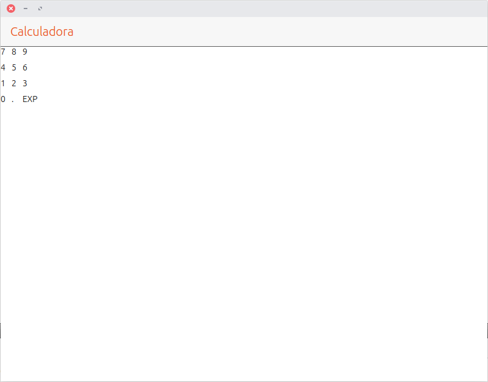
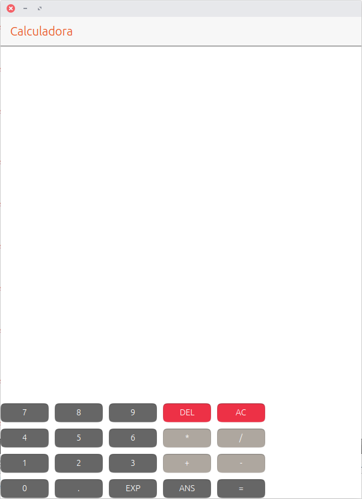
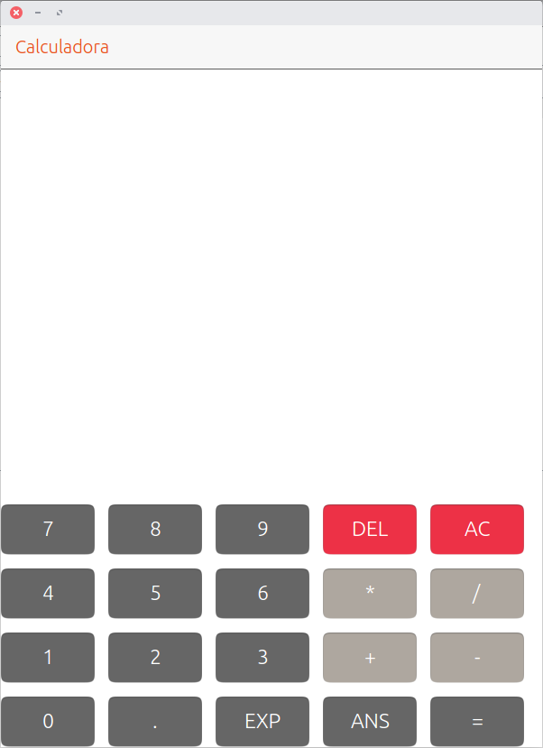

# Organización de los componentes
En el ejercicio 1 habéis distribuido los números en columnas. Como me habéis comentado esa distribución de los números corresponde a un teclado de teléfono y no al de una calculadora. Con el fin de que quede más claro añado una tabla con la distribución que se debe seguir. He añadido un par de textos nuevos para simplificar más adelante el desarrollo.

| Columna 1 | Columna 2 | Columna 3 |
| --- | --- | --- |
| **7** | 8 | **9** |
| **4** | 5 | **6** |
| **1** | 2 | **3** |
| **0** | . | **EXP** |

La tabla tiene tres columnas. Si se agrupan los números en columnas (como se pedía en el ejercicio) el resultado sería el mostrado en la siguiente imagen.


El bloque de código es:

```js
// Primera columna
Column {

  anchors.top: pageHeader.bottom
  id: column1

  Label {
    text: "7"
  }

  Label {
    text: "4"
 }

 Label {
   text: "1"
 }

 Label {
   text: "0"
 }

}

// Segunda columna

Column {

  anchors.top: column1.bottom

  id: column2

  Label {
    text: "8"
  }

  Label {
    text: "5"
  }

  Label {
    text: "2"
  }

 Label {
   text: "."
 }

}

// Tercera columna
Column {

  anchors.top: column2.bottom
  id: column3

  Label {
    text: "9"
  }

  Label {
    text: "6"
  }

  Label {
    text: "3"
  }

  Label {
    text: "EXP"
  }

}
```

Salvo que estéis programando una calculadora de diseño, la captura de pantalla se parece poco a la tabla inicial. Las columnas son correctas pero se distribuyen una detrás de la otra y no en paralelo. Para distribuir los números en una fila hay que recurrir al layout Row.

## El layout Row

El layout Row (fila) funciona igual que Column con la diferencia que los componentes se distribuyen en una fila. La estructura que sigue el layout es la siguiente:

```js
Row {
  // Componente

}
```

Siguiendo con el ejemplo de la tabla anterior las filas se definirían de la siguiente forma:
| Columna 1 | Columna 2 | Columna 3 |
| --- | --- | --- |
| **7** | **8** | **9** |
| 4 | 5 | 6 |
| **1** | **2** | **3** |
| 0 | . | EXP |

Si la tabla se define usando únicamente filas aparecería el mismo problema de antes. La única diferencia es que los números estarían distribuidos en filas y no en columnas. Para resolver el problema bien es necesario separar la tabla en filas y columnas. Las filas contendrán los números en horizontal y será en total cuatro. Ya sólo quedaría definir la relación que tienen las filas entre sí usando el layout Column.


El código es parecido al caso anterior. Sólo hay que cambiar la forma en la que están organizados los componentes.

```js

// Primera columna
Column {

 anchors.top: pageHeader.bottom
 id: column1

 // Fila 1
 Row {

   Label {
     text: "7"
   }

   Label {
     text: "8"
   }

   Label {
     text: "9"
   }

 }

 // Fila 2
 Row {

    Label {
      text: "4"
    }

    Label {
      text: "5"
    }

    Label {
      text: "6"
    }

  }

  // Fila 3
  Row {

    Label {
      text: "1"
    }

    Label {
      text: "2"
    }

    Label {
      text: "3"
    }

  }

  // Fila 4
  Row {

    Label {
      text: "0"
    }

    Label {
      text: "."
    }

    Label {
      text: "EXP"
    }

  }

}
```

De esta forma se logra el objetivo de distribuir los números en una tabla. Al separar la definición de las filas y las columnas es posible tener en una fila 3 componentes y en otra sólo uno. Si todas las filas de la tabla tienen el mismo número de elementos se puede usar el layout Grid que simplifica el código QML y nos da más flexibilidad

## El layout grid
Cuando los componentes se distribuyen en forma de tabla y todas las filas tienen el mismo número de columnas se puede usar este layout. La estructura que sigue es la siguiente:

```js
Grid {
  columns: 3

  // Componentes
}
```

El parámetro más importante es el número de columnas. De forma automática el layout distribuirá los componentes hasta llegar al número de columnas que se han definido. Si se introduce un componente más automáticamente añade una fila y lo añade en la primera columna.



Al definir un layout se pueden añadir una serie de parámetros que modifican su comportamiento. En este caso se define el número de columnas. Como podéis ver en el código los componentes no tienen ninguna relación que indique como van distribuidos. Están todos seguidos y es el Grid el que se encarga de distribuirlos.

```js
Grid {

  anchors.top: pageHeader.bottom
  spacing: 10
  columns: 3

  // Fila 1
  Label {
    text: "7"
  }

  Label {
    text: "8"
  }

  Label {
    text: "9"
  }

  // Fila 2
  Label {
    text: "4"
  }

  Label {
    text: "5"
  }

  Label {
    text: "6"
  }

  // Fila 3
  Label {
    text: "1"
  }

  Label {
    text: "2"
  }

  Label {
    text: "3"
  }

  // Fila 4
  Label {
    text: "0"
  }

  Label {
    text: "."
  }

  Label {
    text: "EXP"
  }

}
```

## El botón
La etiqueta es un componente que permite mostrar información al usuario. En el capítulo ha servido como introducción a QML y al uso de los layouts. La calculadora que se está desarrollando tiene que permitir al usuario introducir los números y las operaciones a realizar. Para hacerlo hay que recurrir a otro componente como es el botón.

Un botón tiene asociado un texto que indica al usuario la función que realiza. De la misma forma al pulsarlo el usuario se genera una acción que permite ejecutar un código asociado. La estructura del botón es un poco más compleja que la que tiene la etiqueta y se irá viendo poco a poco.

```js
Button {
  text: "Texto"
}
```

**Ejercicio 4**. Tomando como base el código que muestra las etiquetas en un grid hay que hacer varios cambios: * Sustituir las etiquetas por botones. Para hacerlo es suficiente con cambiar el texto Label por Button.

* Modificar el anchor del grid para que esté alineado en la parte inferior de la pantalla.
* Añadir a la tabla dos columnas nuevas con los botones que se muestran en la imagen.


El código del ejercicio es el siguiente:

```js
Grid {

  anchors.bottom: page.bottom
  spacing: 10
  columns: 5

  // Fila 1
  Button {
    text: "7"
  }

  Button {
    text: "8"
  }

  Button {
    text: "9"
  }

  Button {
    text: "DEL"
  }

  Button {
    text: "AC"
  }

  // Fila 2
  Button {
    text: "4"
  }

  Button {
    text: "5"
  }

  Button {
    text: "6"
  }

  Button {
    text: "*"
  }

  Button {
    text: "/"
  }

  // Fila 3
  Button {
    text: "1"
  }

  Button {
    text: "2"
  }

  Button {
    text: "3"
  }

  Button {
    text: "+"
  }

  Button {
    text: "-"
  }

  // Fila 4
  Button {
    text: "0"
  }

  Button {
    text: "."
  }

  Button {
    text: "EXP"
  }

  Button {
    text: "ANS"
  }

  Button {
    text: "="
  }

}
```

En este punto la aplicación ya se empieza a parecer a una calculadora. Hay dos cambios que mejorarían mucho la apariencia. El primero es el color de los botones. Las calculadoras tienen botones oscuros y dependiendo de la función el color varía. Por su parte, el segundo cambio es el tamaño de los botones. No hay que olvidar que la calculadora debe funcionar en un dispositivo real y normalmente los dedos del usuario ocupan más espacio que el puntero del ratón.

### Configuración del color

Ubuntu Touch tiene una serie de colores definidos en su paleta. Si se emplean a la hora de diseñar el interfaz de la aplicación el resultado será una aplicación que queda visualmente integrada en el sistema. Para definir el color de fondo de un botón se usa la propiedad color.

```js
Button {
  text: "8"
  color: UbuntuColors.graphite
}
```

**Ejercicio 5**. Tenéis que cambiar el color de fondo de todos los botones. Los números deben tener un color gris oscuro. Las operaciones un gris claro y los botones DEL y AC un color rojizo. Para completar el ejercicio hay que cambiar el color de fondo. No importa que no coincida con el de la pantalla.



El código del ejercicio es:
```js
Grid {

  anchors.bottom: page.bottom
  spacing: 10
  columns: 5

  // Fila 1
  Button {
    text: "7"
    color: UbuntuColors.graphite
  }

  Button {
    text: "8"
    color: UbuntuColors.graphite
  }

  Button {
    text: "9"
    color: UbuntuColors.graphite
  }

  Button {
    text: "DEL"
    color: UbuntuColors.red
  }

  Button {
    text: "AC"
    color: UbuntuColors.red
  }

 // Fila 2
 Button {
   text: "4"
   color: UbuntuColors.graphite
 }

 Button {
   text: "5"
   color: UbuntuColors.graphite
 }

 Button {
   text: "6"
   color: UbuntuColors.graphite
 }

 Button {
   text: "*"
   color: UbuntuColors.warmGrey
 }

 Button {
   text: "/"
   color: UbuntuColors.warmGrey
 }

 // Fila 3
 Button {
   text: "1"
   color: UbuntuColors.graphite
 }

 Button {
   text: "2"
   color: UbuntuColors.graphite
 }

 Button {
   text: "3"
   color: UbuntuColors.graphite
 }

 Button {
   text: "+"
   color: UbuntuColors.warmGrey
 }

 Button {
   text: "-"
   color: UbuntuColors.warmGrey
 }

 // Fila 4
 Button {
   text: "0"
   color: UbuntuColors.graphite
 }

 Button {
   text: "."
   color: UbuntuColors.graphite
 }

 Button {
   text: "EXP"
   color: UbuntuColors.graphite
 }

 Button {
   text: "ANS"
   color: UbuntuColors.graphite
 }

 Button {
   text: "="
   color: UbuntuColors.graphite
 }

}
```

### Modificar el tamaño del botón

El interfaz de usuario de la calculadora se puede usar en el ordenador pero los botones son un poco pequeños para un dispositivo real. Un detalle importante es que el interfaz se tiene que adaptar a las características del dispositivo. No es lo mismo tener una pantalla de teléfono en vertical a tenerla en horizontal. De momento se tomará como dispositivo ideal uno que tenga la pantalla en vertical.

Los botones tienen dos propiedades que permiten definir su tamaño en vertical y en horizontal. El texto del botón no se adapta de forma automática al tamaño del botón que lo contiene por lo que habrá que adaptarlo también. El botón quedaría con la siguiente estructura:

```js
Button {

  // Texto y tamaño de la fuente
  text: "7"
  font.pointSize: 17

  // Color de fondo
  color: UbuntuColors.graphite

  // Dimensiones del botón
  width: buttonWidth
  height: buttonHeight

}
```

Hay que repetir la misma estructura en todos los botones. Para que sea más sencillo ajustar el tamaño del botón (recordad que ahora se está definiendo de forma manual) hay definidas dos variables que contienen la dimensión en GridUnits. Las variables se definen antes de la vista (Page) y tienen la siguiente estructura:

```js
property real buttonWidth: units.gu(13)
property real buttonHeight: units.gu(7)
```

Se define con la palabra property para indicar que es una variable. Real define un número con decimales. Recordad que las dimensiones hay que ponerlas en forma de GridUnits.

**Ejercicio 6**. Tenéis que ajustar el tamaño del texto y las dimensiones de todos los botones de la calculadora. El resultado tiene que ser similar al siguiente:



El código asociado:

```js
Grid {

  anchors.bottom: page.bottom
  anchors.left: parent.left
  anchors.right: parent.right

  spacing: 15
  columns: 5

  // Fila 1
  Button {
    text: "7"

    font.pointSize: 17
    color: UbuntuColors.graphite

    width: buttonWidth
    height: buttonHeight
  }

 Button {
   text: "8"

   font.pointSize: 17
   color: UbuntuColors.graphite

   width: buttonWidth
   height: buttonHeight
 }

 Button {
   text: "9"

   font.pointSize: 17
   color: UbuntuColors.graphite

   width: buttonWidth
   height: buttonHeight
 }

 Button {
   text: "DEL"

   font.pointSize: 17
   color: UbuntuColors.red

   width: buttonWidth
   height: buttonHeight
 }

 Button {
   text: "AC"

   font.pointSize: 17
   color: UbuntuColors.red

   width: buttonWidth
   height: buttonHeight
 }

 // Fila 2
 Button {
   text: "4"

   font.pointSize: 17
   color: UbuntuColors.graphite

   width: buttonWidth
   height: buttonHeight
 }

 Button {
   text: "5"

   font.pointSize: 17
   color: UbuntuColors.graphite

   width: buttonWidth
   height: buttonHeight
 }

 Button {
   text: "6"

   font.pointSize: 17
   color: UbuntuColors.graphite

   width: buttonWidth
   height: buttonHeight
 }

 Button {
   text: "*"

   font.pointSize: 17
   color: UbuntuColors.warmGrey

   width: buttonWidth
   height: buttonHeight
 }

 Button {
   text: "/"

   font.pointSize: 17
   color: UbuntuColors.warmGrey

   width: buttonWidth
   height: buttonHeight
 }

 // Fila 3
 Button {
   text: "1"

   font.pointSize: 17
   color: UbuntuColors.graphite

   width: buttonWidth
   height: buttonHeight
 }

 Button {
   text: "2"

   font.pointSize: 17
   color: UbuntuColors.graphite

   width: buttonWidth
   height: buttonHeight
 }

 Button {
   text: "3"

   font.pointSize: 17
   color: UbuntuColors.graphite

   width: buttonWidth
   height: buttonHeight
 }

 Button {
   text: "+"

   font.pointSize: 17
   color: UbuntuColors.warmGrey

   width: buttonWidth
   height: buttonHeight
 }

 Button {
   text: "-"

   font.pointSize: 17
   color: UbuntuColors.warmGrey

   width: buttonWidth
   height: buttonHeight
 }

 // Fila 4
Button {
  text: "0"

  font.pointSize: 17
  color: UbuntuColors.graphite

  width: buttonWidth
  height: buttonHeight
  }

 Button {
   text: "."

   font.pointSize: 17
   color: UbuntuColors.graphite

   width: buttonWidth
   height: buttonHeight
 }

 Button {
   text: "EXP"

   font.pointSize: 17
   color: UbuntuColors.graphite

   width: buttonWidth
   height: buttonHeight
 }

 Button {
   text: "ANS"

   font.pointSize: 17
   color: UbuntuColors.graphite

   width: buttonWidth
   height: buttonHeight
 }

 Button {
   text: "="

   font.pointSize: 17
   color: UbuntuColors.graphite

   width: buttonWidth
   height: buttonHeight
 }

}
```

Con este último ejemplo acaba la entrega de esta semana. El siguiente paso consiste en añadir una etiqueta en la parte superior de la pantalla para mostrar las operaciones y su resultado.
