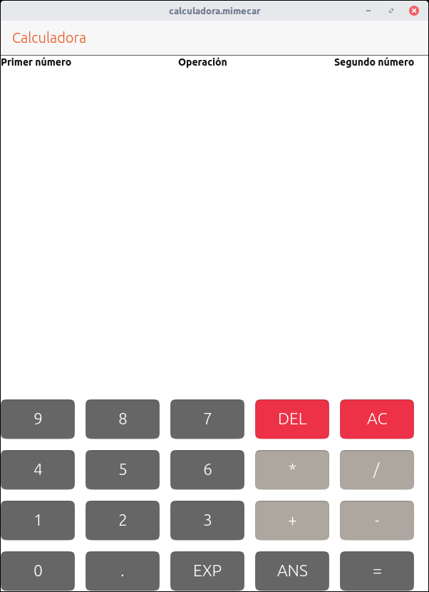
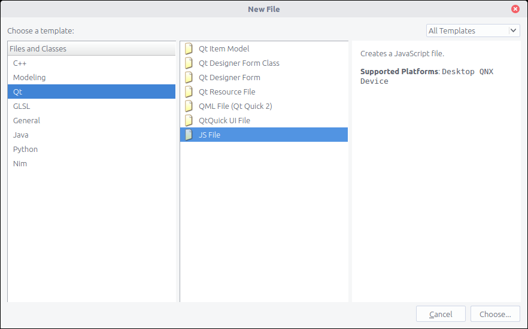

# chapter-04-s04

## Introducción a JavaScript

Hasta ahora se ha estudiado el uso de QML para crear el interfaz de usuario de la aplicación de calculadora. En la última entrega se añadió una pequeña lógica a los botones de forma que se concatenara el texto del botón al texto que mostraba la etiqueta de los resultados. El funcionamiento era muy simple y consistía en capturar la señal que se genera al pulsar el botón y modificar el texto de la etiqueta.

Al programar aplicaciones es importante separar el interfaz de la lógica que tiene por debajo. Esto permite al programador mantener el funcionamiento aunque cambie la apariencia de la aplicación. Un ejemplo claro es la apariencia que tiene una aplicación en un dispositivo que está en configuración vertical o en configuración horizontal. Por esta razón se moverá toda la lógica a un archivo JavaScript externo. El código tomará datos del interfaz de usuario, los procesará y actuará sobre el interfaz para mostrar los resultados. No es una entrega especialmente complicada pero si os puede costar un poco más por los conceptos que se introducen. Como siempre, ante cualquier duda podéis usar los recursos del curso.

### Mostrar el estado de las operaciones en el interfaz

El flujo de la aplicación se mantiene: el usuario introduce el primer número, pulsa en una operación, introduce el segundo número y finalmente pulsa el botón de "=". Cada una de estas operaciones representa un paso en el algoritmo que se sigue para hacer la operación. Para que sea más visual hay que hacer una pequeña modificación al interfaz de la calculadora para añadir tres etiquetas en la parte superior.



Con lo que se ha visto en el curso deberíais ser capaces de añadir las etiquetas sin demasiados problemas. El elemento más externo es un layout Row que permite distribuir los componentes en horizontal. Después hay que crear tres etiquetas con los nombres mostrados en la captura. Más adelante se modificaran esas etiquetas, por esta razón deben tener un ID asociado. Por último las etiquetas están modificadas para que muestren el texto en negrita.

El código del bloque es el siguiente:

```javascript
Row {

  anchors.top: pageHeader.bottom
  spacing: 150

  Label {
    id: primerNumero

    text: "Primer número"
    font.bold: true
  }

  Label {
    id: operacion

    text: "Operación"
    font.bold: true
  }

  Label {
    id: segundoNumero

    text: "Segundo número"
    font.bold: true
  }

}
```

### Asociar los botones con el archivo JavaScript

Cuando se pulsa un botón se genera la señal onClicked. En el código que gestiona la señal se hará la llamada a las diferentes funciones que hay en el archivo JavaScript. Como parámetro se pasará el texto que tiene cada botón, no importa que sea un número o una operación. Un detalle importante es que por salud mental todos los números utilizan la misma función para introducir los datos. Lo mismo se aplica a las operaciones y al botón de igual. ¿Cómo se diferenciará entre números y operaciones para realizar la operación? La aplicación sólo sabe que el usuario pulsa botones, no lo que significan.

Quedarán tres funciones que se usarán para implementar la lógica de la calculadora.

* MathFunctions.insertNumber\(text\)
* MathFunctions.insertOperation\(text\)
* MathFunctions.calculate\(\)

La primera parte indica la librería que incluye las funciones de JavaScript. La librería es propia para esta aplicación. De momento no se usarán librerías de terceros. En el ejercicio de la última entrega puse como deberes conectar todos los botones con la etiqueta de resultado. Tomando ese código como base hay que sustituir las llamadas del onClicked por una de las tres llamadas anteriores. Con el código se ve más claro. Fijaros en el onClicked de los botones.

```javascript
// -----------------
// Grid de botones
// -----------------
Grid {

  id: grid
  anchors.bottom: page.bottom
  spacing: 15
  columns: 5

  // Fila 1
  Button {
    text: "9"

    font.pointSize: 17
    color: UbuntuColors.graphite

    width: buttonWidth
    height: buttonHeight

    // Insertamos el número
    onClicked: MathFunctions.insertNumber(text)
  }

  Button {
    text: "8"

    font.pointSize: 17
    color: UbuntuColors.graphite

    width: buttonWidth
    height: buttonHeight

    // Insertamos el número
    onClicked: MathFunctions.insertNumber(text)
  }

  Button {
    text: "7"

    font.pointSize: 17
    color: UbuntuColors.graphite

    width: buttonWidth
    height: buttonHeight

    // Insertamos el número
    onClicked: MathFunctions.insertNumber(text)
  }

  Button {
    text: "DEL"

    font.pointSize: 17
    color: UbuntuColors.red

    width: buttonWidth
    height: buttonHeight
  }

 Button {
   text: "AC"

   font.pointSize: 17
   color: UbuntuColors.red

   width: buttonWidth
   height: buttonHeight
 }

  // Fila 2
  Button {
    text: "4"

    font.pointSize: 17
    color: UbuntuColors.graphite

    width: buttonWidth
    height: buttonHeight

    // Insertamos el número
    onClicked: MathFunctions.insertNumber(text)
  }

 Button {
   text: "5"

   font.pointSize: 17
   color: UbuntuColors.graphite

   width: buttonWidth
   height: buttonHeight

   // Insertamos el número
   onClicked: MathFunctions.insertNumber(text)
 }

 Button {
   text: "6"

   font.pointSize: 17
   color: UbuntuColors.graphite

   width: buttonWidth
   height: buttonHeight

   // Insertamos el número
   onClicked: MathFunctions.insertNumber(text)
 }

 Button {
   text: "*"

   font.pointSize: 17
   color: UbuntuColors.warmGrey

   width: buttonWidth
   height: buttonHeight

   // Insertamos la operación
   onClicked: MathFunctions.insertOperation(text)
 }

 Button {
   text: "/"

   font.pointSize: 17
   color: UbuntuColors.warmGrey

   width: buttonWidth
   height: buttonHeight

   // Insertamos la operación
   onClicked: MathFunctions.insertOperation(text)
 }

  // Fila 3
  Button {
    text: "1"

    font.pointSize: 17
    color: UbuntuColors.graphite

    width: buttonWidth
    height: buttonHeight

    // Insertamos el número
    onClicked: MathFunctions.insertNumber(text)
  }

 Button {
   text: "2"

   font.pointSize: 17
   color: UbuntuColors.graphite

   width: buttonWidth
   height: buttonHeight

   // Insertamos el número
   onClicked: MathFunctions.insertNumber(text)
 }

 Button {
   text: "3"

   font.pointSize: 17
   color: UbuntuColors.graphite

   width: buttonWidth
   height: buttonHeight

   // Insertamos el número
   onClicked: MathFunctions.insertNumber(text)
 }

 Button {
   text: "+"

   font.pointSize: 17
   color: UbuntuColors.warmGrey

   width: buttonWidth
   height: buttonHeight

   // Insertamos la operación
   onClicked: MathFunctions.insertOperation(text)
 }

 Button {
   text: "-"

   font.pointSize: 17
   color: UbuntuColors.warmGrey

   width: buttonWidth
   height: buttonHeight

   // Insertamos la operación
   onClicked: MathFunctions.insertOperation(text)
 }

 // Fila 4
 Button {
   text: "0"

   font.pointSize: 17
   color: UbuntuColors.graphite

   width: buttonWidth
   height: buttonHeight

   // Insertamos el número
   onClicked: MathFunctions.insertNumber(text)
 }

 Button {
   text: "."

   font.pointSize: 17
   color: UbuntuColors.graphite

   width: buttonWidth
   height: buttonHeight
 }

 Button {
   text: "EXP"

   font.pointSize: 17
   color: UbuntuColors.graphite

   width: buttonWidth
   height: buttonHeight
 }

 Button {
   text: "ANS"

   font.pointSize: 17
   color: UbuntuColors.graphite

   width: buttonWidth
   height: buttonHeight
 }

 Button {
   text: "="

   font.pointSize: 17
   color: UbuntuColors.graphite

   width: buttonWidth
   height: buttonHeight

   // Insertamos el número
   onClicked: MathFunctions.calculate()
 }

}
```

Por último es necesario añadir el código que carga la librería de JavaScript. Es normal que de errores ya que el archivo no existe de momento.

```javascript
import "MathFunctions.js" as MathFunctions
```

Con estas modificaciones el código no compilará. Se ha completado la parte del archivo QML pero ahora llega la creación del archivo JavaScript.

### Creación del archivo JavaScript

En el árbol de proyectos de QtCreator hay que pulsar en el nodo Calculadora.


Botón derecho, Add new, Categoría Qt, JS File.



El asistente para crear el archivo tiene tres pasos. En el primero se pone el nombre, en el segundo se configura el tipo de librería y en el último aparece un resumen. Hay que dejar la misma configuración que se muestra en las capturas de pantalla.


## Estructura del archivo JavaScript

En el archivo JavaScript se incluirán todos los métodos que procesan los datos que introduce el usuario en la calculadora. Cada método opera sobre los parámetros que recibe \(desde la llamada que hace el onClicked\) y trabaja sobre las variables del algoritmo. Al mismo tiempo también actúa sobre el interfaz para informar al usuario. Es muy importante que el usuario tenga realimentación o pensará que la aplicación no hace nada o está bloqueada.

A continuación se verá el código de cada uno de los métodos. Hay bastante código pero no es complicado de entender.

### inserNumber\(number\)

Un método / función es una estructura que toma unos datos y hace operaciones sobre ellos. Permite en nuestro caso que todos los botones que muestran un número tengan un lugar centralizado para poner su valor. Si no se usara una función el código de cada botón estaría duplicado. Esto es muy mala idea porque si en algún momento hay que modificar el código por un error sería necesario hacer lo mismo en todos los números. Al final las posibilidades de cometer un error aumentaría de forma importante. Estos problemas no aparecen al usar métodos / funciones.

Para trabajar con el número es necesario pasarlo al método como parámetro. Ese valor se procesa en un algoritmo \(una serie de pasos a seguir\) que permite realizar los cálculos.

```javascript
function insertNumber(number) {

  if (isSecondNumberReady == false) {

    // Componemos el número y actualizamos la etiqueta de resultado
    firstNumber = firstNumber * 10 + parseInt(number)
    labelResult.text = firstNumber

    // Indicación del estado de la operacion
    labelFirstNumber.color = UbuntuColors.orange
    labelOperation.color = UbuntuColors.graphite
    labelSecondNumber.color = UbuntuColors.graphite

 } else {

   // Componemos el número y actualizamos la etiqueta de resultado
   secondNumber = secondNumber * 10 + parseInt(number)

   labelResult.text = firstNumber + " " + operation + " " + secondNumber

   // Indicación del estado de la operación
   labelFirstNumber.color = UbuntuColors.graphite
   labelOperation.color = UbuntuColors.graphite
   labelSecondNumber.color = UbuntuColors.orange

 }

}
```

La sentencia if permite ejecutar diferentes partes del código dependiendo de si se cumple una condición. Si se cumple se ejecuta el primer bloque que hay entre llaves. En caso contrario el segundo bloque \(el perteneciente a else\). Ambos bloques son exclusivos y si se ejecuta uno el otro no se puede ejecutar.

En el algoritmo de cálculo necesitamos dos números y una operación. Sería razonable tener un método para el primer número y otro para el segundo número. El problema es, ¿cómo sabemos que el usuario ha terminado de escribir el primer número y quiere poner el segundo? El elemento separador es la operación que realice. Cuando se pulse uno de los botones asociados a las operaciones el primer número estará completo. El bloque del if comprueba esa condición. Si el algoritmo no está preparado para introducir el segundo número introduce el primero. La variable isSecondNumberReady actúa como bandera \(FLAG\) y permite discriminar el punto del algoritmo en el que se encuentra el código.

Primero es necesario procesar el número que ha introducido el usuario. Al método llega como parámetro una cadena de texto \(string\) y los números no pueden ser cadenas de texto. Por esta razón hay que convertirlo primero a número con el ḿetodo parseInt. El número se va acumulando a medida que lo introduce el usuario. La primera vez se tendrá un número, por ejemplo el 7. Si el usuario pulsa de nuevo el 7 hay que desplazar el primer número a la izquierda y sumarle el nuevo número. El desplazamiento se consigue multiplicando por 10 el número que teníamos inicialmente.

```javascript
firstNumber = firstNumber * 10 + parseInt(number)
```

Una vez se ha procesado el número hay que informar al usuario. Se usará una referencia a la etiqueta resultado que está en el archivo QML. Es importante que la etiqueta tenga definido un ID. ¿Cómo se asocian los ID de los componentes con el QML? Lo veremos más adelante. El código pone como texto de la etiqueta el número que hemos calculado.

```javascript
labelResult.text = firstNumber
```

Al principio de la entrega se han añadido tres etiquetas a la pantalla de la calculadora. Dependiendo del paso del algoritmo se iluminará una de esas etiquetas de forma que se sepa de forma clara el estado. El funcionamiento es el mismo que en el caso anterior: se utiliza la referencia y el atributo que se pretende modificar.

```javascript
labelFirstNumber.color = UbuntuColors.orange
labelOperation.color = UbuntuColors.graphite
labelSecondNumber.color = UbuntuColors.graphite
```

La lógica de funcionamiento en el otro bloque del if es similar. La única diferencia es que el valor de la etiqueta de resultado incluirá el primer número, la operación y el segundo número.

```javascript
labelResult.text = firstNumber + " " + operation + " " + secondNumber
```

### Método insertOperation

La explicación del método anterior afecta también a este método. Guardamos el parámetro que introduce el usuario y se actualiza el estado de las etiquetas que hay en la parte superior.

```javascript
function insertOperation(userOperation) {

  operation = userOperation
  labelResult.text = firstNumber + " " + operation

  // Indicación del estado de la operación
  isSecondNumberReady = true

  labelFirstNumber.color = UbuntuColors.graphite
  labelOperation.color = UbuntuColors.orange
  labelSecondNumber.color = UbuntuColors.graphite

}
```

### Método calculate\(\)

Este método es el encargado de realizar las operaciones. Se llama cuando el usuario pulsa el botón Igual. Un detalle importante es que sólo se aplica una validación en la división por cero para evitar errores. El usuario puede pulsar los botones en cualquier orden y en el código actual aparecerán errores divertidos. Por ejemplo, al pulsar el botón igual después de introducir el primer número y la operación. Como las variables que se usan para los cálculos tienen valores por defecto no debería ser catastrófico. En la siguiente entrega se verá la forma de evitar estos problemas.

Dependiendo del tipo de operación se aplican unos cálculos u otros. Al finalizar el cálculo todas las etiquetas tienen que volver a su estado inicial.

```javascript
function calculate() {

  if (operation == "+") {

    resultado.text = firstNumber + secondNumber

  } else if (operation == "-") {

    resultado.text = firstNumber - secondNumber

 } else if (operation == "*") {

   resultado.text = firstNumber * secondNumber

 } else if (operation == "/") {

   if (secondNumber != 0) {

     resultado.text = firstNumber / secondNumber

   } else {

     resultado.text = 0

   }

 }

  // Indicación del estado de la operación
  labelFirstNumber.color = UbuntuColors.graphite
  labelOperation.color = UbuntuColors.graphite
  labelSecondNumber.color = UbuntuColors.graphite

  // Inicializamos las variables para la siguiente iteración
  firstNumber = 0
  operation = ""
  secondNumber = 0

  isSecondNumberReady = false

}
```

El algoritmo usa varias variables auxiliares para guardar la información. Una vez ha finalizado el cálculo hay que restaurar sus valores iniciales.

```javascript
// Inicializamos las variables para la siguiente iteración
firstNumber = 0
operation = ""
secondNumber = 0
isSecondNumberReady = false
```

## Conexión entre el archivo QML y el archivo JavaScript

Para acceder a los controles del archivo QML desde el código JavaScript es necesario tener una referencia a los mismos. Esta referencia se pasa al finaldel archivo QML. Cuando un archivo QML se ha cargado se genera una señal. Si se procesa es posible pasar las referencias al archivo JavaScript. Aunque es posible hacer la asociación al principio se corre el riesgo de que el archivo no esté inicializado y pasen cosas malas.

En el archivo QML hay que añadir antes de la última llave el siguiente codigo:

```javascript
// Cuando se ha inicializado el archivo QML hacemos lo mismo con el archivo de JavaScript
Component.onCompleted: MathFunctions.start(primerNumero, operacion,
  segundoNumero, resultado)
```

Por su parte, en el archivo JavaScript es necesario implementar la función anterior.

```javascript
function start(firstNumberComponent, operationComponent,
  secondNumberComponent, resultComponent) {

    // Log en la consola
    console.log("Calculadora conectada al archivo JS")

 // Asignación de las variables
 labelFirstNumber = firstNumberComponent
 labelOperation = operationComponent
 labelSecondNumber = secondNumberComponent
 labelResult = resultComponent

}
```

En el archivo JavaScript hay una serie de variables globales \(que no están dentro de un método\) que guardarán las referencias que se pasan como parametro. Es posible escribir mensajes de depuración en la consola de QtCreator con el código:

```javascript
console.log("Calculadora conectada al archivo JS")
```

Con esto finaliza la entrega de esta semana. Son muchos conceptos nuevos pero es importante entenderlos bien porque los usaremos bastante. La calculadora ya puede hacer operaciones básicas. Quedaría implementar el uso de decimales y añadir la funcionalidad a los botones que faltan. Usar QML y JavaScript no es complicado. Una vez que se entiende la lógica de funcionamiento es sencillo añadir nuevas funciones.

Podéis ver el funcionamiento de la aplicación en las siguientes capturas.


El ejercicio para la siguiente entrega consiste en que penséis la forma de evitar que el usuario introduzca mal el orden de los cálculos o que pasaría si introduce errores de forma voluntaria como poner varios puntos decimales o divide números pequeños por números muy grandes.

¿Qué tal vaís de operaciones en binario y en hexadecimal?

