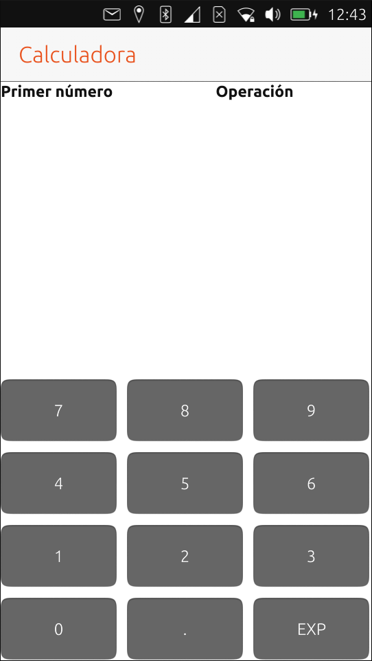
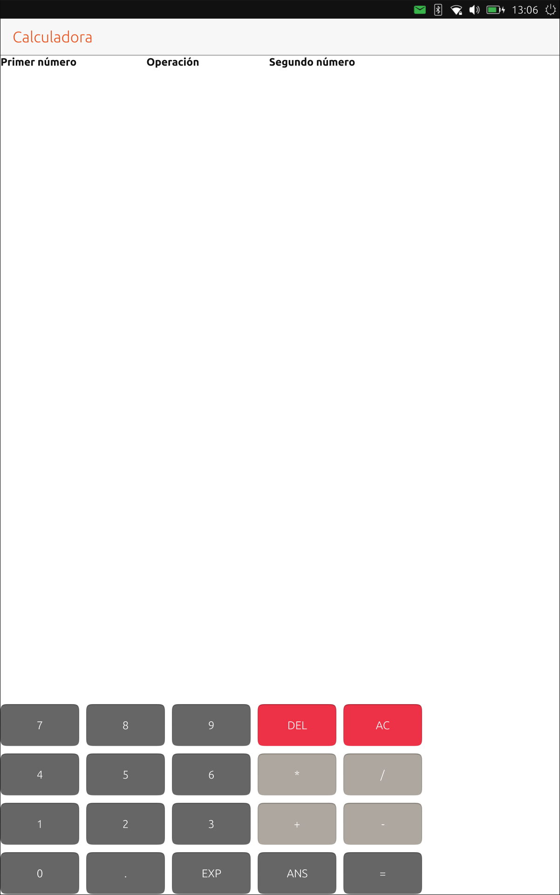
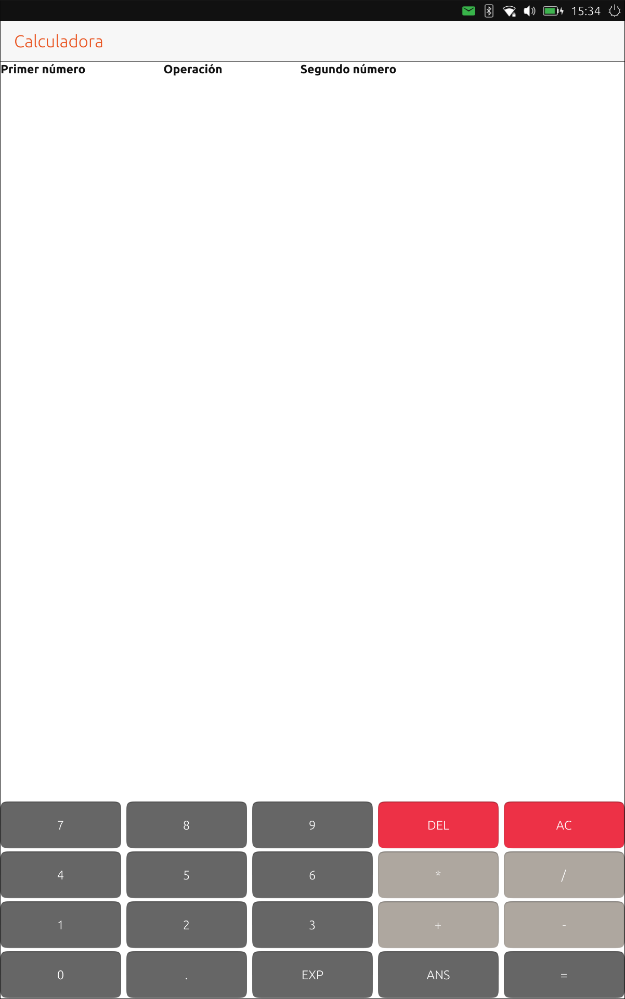
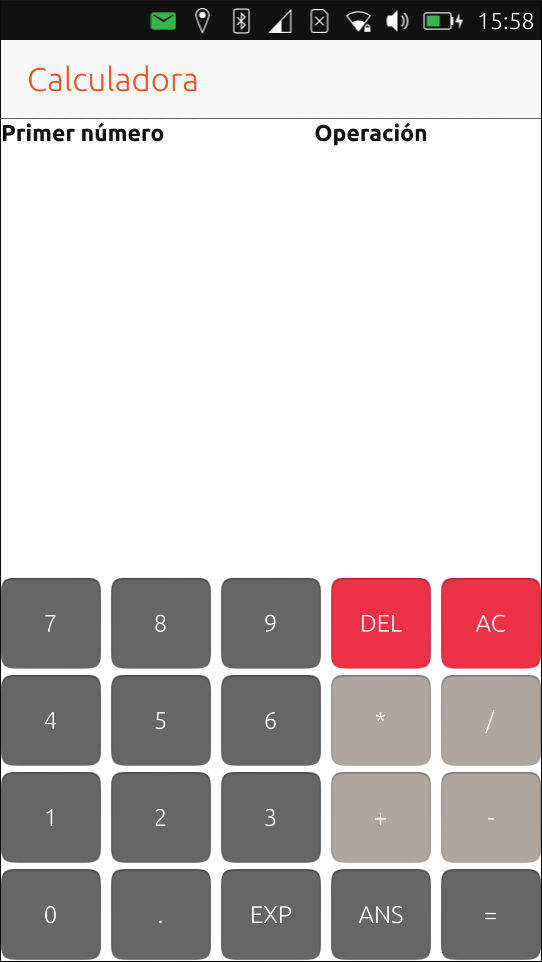
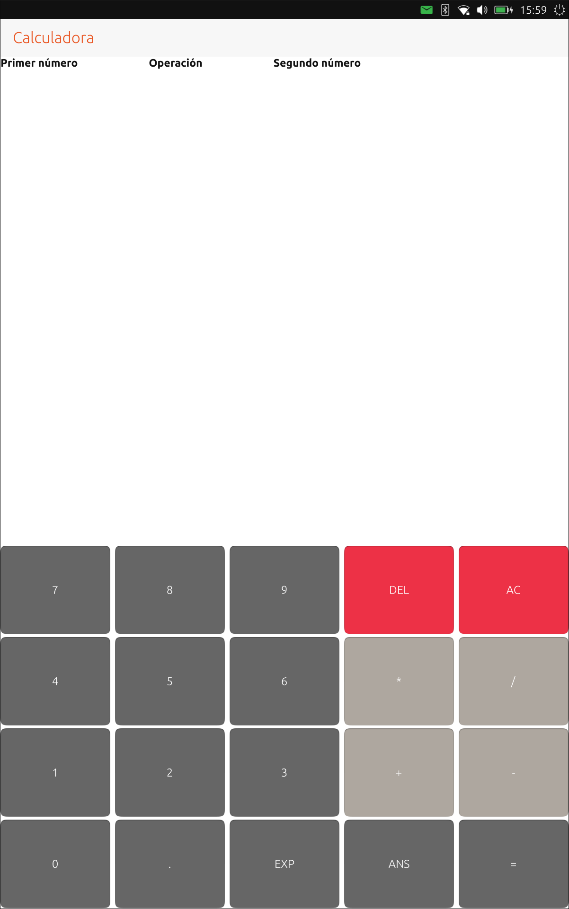

# Adaptación del interfaz a la pantalla
Como bien ha reportado Cesar Herrera en LaunchPad, la calculadora tenía dos errores. El [primero](https://bugs.launchpad.net/curso-ubuntu-phone-touch/+bug/1627080) afecta al orden de los botones de la primera fila mientras que el [segundo](https://bugs.launchpad.net/curso-ubuntu-phone-touch/+bug/1627072) a una división por cero. Podéis consultar el capítulo **Herramientas** (pendiente de actualizar) para conocer los pasos que hay que seguir para corregir ambos fallos y hacer el commit asociando los identificadores de bug de LaunchPad.

El interfaz básico de la calculadora estaría en principio acabado. Un detalle importante que nunca hay que olvidar al programar aplicaciones es el tipo de dispositivo en el que se ejecutará la aplicación. La calculadora se ve bien en el ordenador, ¿ocurrirá lo mismo al ejecutar la aplicación en un teléfono o una tableta? Los dispositivos de prueba son Krillin (Aquaris E4.5) y Frieza (Aquaris M10 FHD). Ambos terminales tienen una orientación vertical. Más adelante se verá la forma de adaptar el interfaz de usuario a la orientación de la pantalla para que se aproveche mejor.

La primera captura corresponde a Krillin mientras que la segunda es de Frieza. ¿Veis el problema?





Al definir el tamaño de los botones se han usado las unidades gráficas (G.U.) que asocian de forma automática el tamaño de un componente con la resolución de la pantalla. En ambas capturas los botones tienen el mismo tamaño por lo que está funcionando de forma correcta el diseño que hay en estos momentos. ¿Cuál es la causa de que no aparezcan bien los botones?

Los botones tienen siempre el mismo tamaño con independencia de la dimensión de la pantalla. Será por tanto necesario modificar el tamaño de los botones para que se adapten a la pantalla. El criterio inicial es que la columna del botón AC esté pegada al borde derecho de la pantalla. Se tienen que ver todos los botones sin problema.

En el código del archivo QML se definen las dimensiones de la pantalla que se usan al ejecutar la aplicación en el ordenador. El valor es arbitrario y simplemente permite ver la aplicación completa sin tener que redimensionar la ventana. Las dimensiones de los botones estaban ajustadas para que se vieran bien en la pantalla.

En QML los componentes se colocan dentro del componte página (Page). Este componente se ajusta a las dimensiones de la pantalla tanto en vertical como en horizontal. Por esta razón puede ser interesante definir el tamaño de los botones en función del ancho de la página. La dimensión de los botones se ajusta con dos variables:

```js
property real buttonWidth: units.gu(13)
property real buttonHeight: units.gu(7)
```

Como prueba se modificará sólo el ancho. Sustituid esa línea por esta otra:

```js
property real buttonWidth: page.width / 5
```

El valor de la variable, que se usa para definir el tamaño de los botones, se actualizará con las dimensiones de la página. Modificad el tamaño de la pantalla en horizontal (arrastrando el borde) para comprobar el efecto.


Los botones adaptan su ancho a las dimensiones de la pantalla.


La calculadora tiene 5 columnas y el ancho de cada botón es el ancho de la página dividido por 5. ¿Por qué no acaba el botón pegado al borde derecho de la pantalla? El ancho del botón es correcto pero hay que tener en cuenta también el layout en el que está contenido el botón. Para distribuir los botones se utiliza un Grid. Ese grid tiene una separación en las filas y las columnas que no se ha tenido en cuenta al definir el ancho de los botones.

Haciendo un par de cálculos sencillos:

* Ancho de la página: page.width * Ancho del botón: buttonWidth* Ancho de la separación entre columnas: columnSeparation

```js
// page.width = 5 * buttonWidth + 4 * columnSeparation
// buttonWidth = (page.width - 4 * columnSeparation) / 5
property real buttonWidth: (page.width - 4 * columnSeparation) / 5
```

La prueba de fuego es la pantalla de Krillin


Para tener más flexibilidad es mejor modificar el ancho que usa el grid (spacing). Inicialmente era el mismo para las filas y las columnas pero se puede separar en filas y columnas de forma independiente.

```js
Grid {
    id: grid
    anchors.bottom: page.bottom
    rowSpacing: 5
    columnSpacing: columnSeparation
    columns: 5
...
```

Al ejecutar el mismo código de la calculadora en Frieza se puede comprobar si están bien los tamaños de los botones.



La distribución del interfaz es la esperada. Una vez se ha definido el ancho de los botones hay que hacer algo parecido con la altura. Por comodidad se definirá la altura en función de la anchura del botón de manera que mantengan siempre la misma proporción entre ancho y alto.

```js
// Variables para el tamaño de los botones
property real columnSeparation: 10
property real buttonWidth: (page.width - 4 * columnSeparation) / 5
property real buttonHeight: buttonWidth / 3
```

Al estar las dimensiones de los botones en función del ancho de la página se adaptan perfectamente a las características de la pantalla. ¿Que pasaría si la pantalla es pequeña? Lo más probable es que no se pudieran pulsar bien los botones.


En este caso no es buena idea definir la altura de los botones en función del ancho del botón. Una solución puede ser tener un archivo QML por dipositivo "tipo" y usar uno u otro dependiendo del caso. No es mala solución pero hay que intentar evitar tener elementos repetidos. El diseño de los botones es muy simple y no vale la pena seguir esa aproximación. En diseños más complejos o que dependan de la orientación de la pantalla si que puede ser interesante.

Como solución de compromiso se definirá la altura de los botones en función de la pantalla siguiendo el mismo criterio que en la anchura. El cálculo es más sencillo:

```js
property real buttonHeight: page.height / 10
```

Con este cambio ha mejorado la usabilidad en Krilin.



En Frieza la solución también es buena. Los botones se pueden usar bien. Al haber modificado la altura de los botones la letra ha quedado un poco más pequeña. Cuando aparecen este tipo de problemas es necesario elegir bien el diseño del interfaz de la aplicación. Una decisión de diseño puede ser óptima en unas condiciones y no tan buena en otras condiciones.



La calculadora ha ganado usabilidad al adaptarse a la pantalla del terminal que la está ejecutando. Como habéis podido observar la adaptación no es perfecta y en algunas ocasiones hay que estudiar alternativas al diseño de la aplicación.
