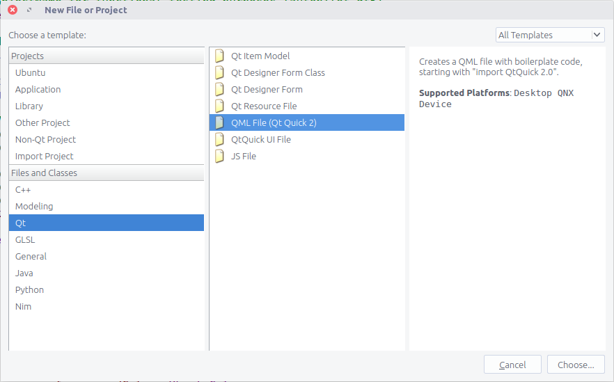
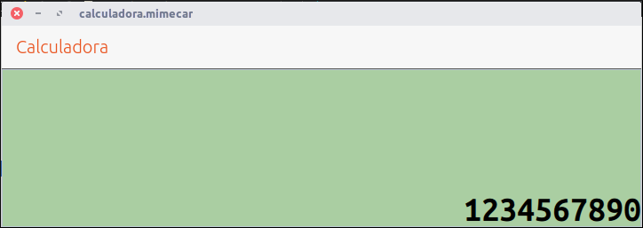
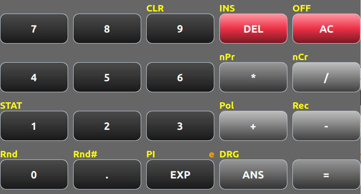

# chapter-04-s06

## Creación de componentes personalizados

A lo largo de las entregas anteriores se han estudiado los conceptos básicos de las aplicaciones nativas de Ubuntu Touch usando QML y JavaScript. Ahora es el momento de dar el siguiente paso e introducir una serie de conceptos que permitirán hacer aplicaciones más complejas y que al mismo tiempo sean razonables de mantener. La calculadora básica tiene 20 botones mientras que el bloque científico tiene 24 botones. Si se parte de que algunos botones de ambos bloques tienen doble funcionalidad la cosa empieza a ser divertida de gestionar.

Aunque es posible tener el código QML en un único archivo no es recomendable hacerlo. Por esta razón se va a dividir el interfaz en tantos archivos como bloques. Con esta organización se tendrá un archivo principal y varios archivos que se encargarán de gestionar el interfaz de cada bloque. Por su parte el archivo principal sólo organizará los bloques dentro de la pantalla.

El siguiente punto a tratar está relacionado con los botones. Se pueden distinguir dos tipos de botones según tengan una función o varias. El primer caso es el que se ha visto hasta este punto en el curso. Cada botón tiene una única funcionalidad. Al tratar con el bloque científico de la calculadora aparecerán botones con doble función. Un caso claro se puede ver con las funciones trigonométricas en las que el botón principal tiene la función trigonométrica y el secundario la función inversa. En este punto hay dos alternativas. La primera alternativa consiste en cambiar la etiqueta del botón principal al pulsar una tecla. Por su parte la segunda alternativa mantiene el texto del botón principal pero muestra la función secundaria encima del botón.

Para la calculadora se ha optado por la segunda opción por una razón sencilla. El objetivo de esta aplicación nativa es programar una calculadora para Ubuntu Touch. Si la calculadora es similar a una calculadora real la curva de aprendizaje de la aplicación será inferior. Esta aproximación no es algo estricto pero si un punto de partida.

Si un botón admite varias funciones \(con un máximo de tres\) se tendrá un botón principal y dos etiquetas que indicarán las funciones extras. Estas etiquetas deben estar alineadas con el botón para que quede bien. Con unos cálculos rápidos se verá a lo que nos estamos enfrentando:

* 20 botones en la calculadora básica.
* 24 botones en la calculadora científica.
* Al menos la mitad de los botones de ambas calculadoras tienen doble función. Si cada botón de este tipo tiene dos funciones haría un total de 44 etiquetas. Cada pareja de etiquetas alineadas con su botón.

El total del cálculo anterior es de 88 componentes entre botones y etiquetas. Se podría usar un grid para alinear los controles pero en ese caso habría que añadir etiquetas vacías para que cuadrarán todos los componentes. A priori no parece algo sencillo de implementar. Por esta razón es mala idea implementar el interfaz de usuario a lo bruto. Será necesario valorar la forma de distribuir todos los elementos y que al mismo tiempo sea sencilla de mantener.

Por último es también importante modificar el comportamiento de la etiqueta que muestra las operaciones. En una calculadora real hay varias líneas en la pantalla LCD. Esas líneas muestran las operaciones, el resultado de las mismas y un histórico de los cálculos previos. Con una etiqueta no se puede mostrar toda la información. Será necesario pensar en una forma de hacerlo.

A continuación se muestran las pantallas de la calculadora antes y después de esta entrega. ¿Estáis preparados?


## Organización de los archivos QML

No es obligatorio separar el interfaz de usuario en varios archivos para que la aplicación funcione. La razón de hacerlo es que la aplicación se vuelve más sencilla de mantener. Programar una aplicación desde cero es sencillo. El problema aparece cuando se añade una función nueva y otras partes de la aplicación empiezan a fallar. En esos casos se simplifica la depuración si cada bloque está acotado en un único archivo.

Al usar un componente QML, por ejemplo una etiqueta \(Label\), la aplicación busca el código que define el componente y le pasa los parámetros que se han introducido en la aplicación. Para poder usar los componentes QML se añaden dos líneas al principio del archivo:

```javascript
import QtQuick 2.4
import Ubuntu.Components 1.3
```

Los dos import indican las librerías que contienen los componentes de QML. El componente QML se busca primero en las librerías y después se busca en la carpeta que contiene el archivo QML. ¿Qué pasaría si se mueve el código del bloque básico de la calculadora a un archivo nuevo? La aplicación lo usaría como un componente QML nuevo y estaría separado del archivo principal.

Para crear un archivo nuevo en el proyecto los pasos son:

* File, New File or project, Qt, QML File.

  

* Escribir el nombre del archivo.

  

* Pulsar el botón Finish.

  

Aparecerá un archivo nuevo con la extensión qml \(llamado BasicCalculator.qml\) y el siguiente contenido:

```javascript
import QtQuick 2.0

Item {
}
```

El contenido del archivo debe ser el grid que contiene los botones de la calculadora básica.

```javascript
// ------------------------------------------------------------------------------------------
// Interfaz de la calculadora básica
// - Curso de programación de Ubuntu Touch
// - https://www.gitbook.com/book/mimecar/curso-de-programacion-de-ubuntu-phone-touch/details
// ------------------------------------------------------------------------------------------
import QtQuick 2.0
import Ubuntu.Components 1.3

// -----------------
// Grid de botones
// -----------------
Grid {

  id: grid
  rowSpacing: 5
  columnSpacing: columnSeparation
  columns: 5

  // Fila 1
  Button {
      text: "7"

      gradcolor: UbuntuColors.coolGrey
      buttonWitdth: buttonWithBasic
      buttonHeight: buttonHeight
  }

  Button {
      text: "8"

      gradcolor: UbuntuColors.coolGrey
      buttonWitdth: buttonWithBasic
      buttonHeight: buttonHeight
  }

  Button {
      text: "9"
      textLeft: "CLR"

      gradcolor: UbuntuColors.coolGrey
      buttonWitdth: buttonWithBasic
      buttonHeight: buttonHeight
  }

  Button {
      text: "DEL"
      textLeft: "INS"

      gradcolor: UbuntuColors.red
      buttonWitdth: buttonWithBasic
      buttonHeight: buttonHeight
  }

  Button {
      text: "AC"
      textLeft: "OFF"

      gradcolor: UbuntuColors.red
      buttonWitdth: buttonWithBasic
      buttonHeight: buttonHeight
  }

  // Fila 2
  Button {
      text: "4"

      gradcolor: UbuntuColors.coolGrey
      buttonWitdth: buttonWithBasic
      buttonHeight: buttonHeight
  }

  Button {
      text: "5"

      gradcolor: UbuntuColors.coolGrey
      buttonWitdth: buttonWithBasic
      buttonHeight: buttonHeight
  }

  Button {
      text: "6"

      gradcolor: UbuntuColors.coolGrey
      buttonWitdth: buttonWithBasic
      buttonHeight: buttonHeight
  }

  Button {
      text: "*"
      textLeft: "nPr"

      buttonWitdth: buttonWithBasic
      buttonHeight: buttonHeight
  }

  Button {
      text: "/"
      textLeft: "nCr"

      gradcolor: "grey"
      buttonWitdth: buttonWithBasic
      buttonHeight: buttonHeight
  }

  // Fila 3
  Button {
      text: "1"
      textLeft: "STAT"

      gradcolor: UbuntuColors.coolGrey
      buttonWitdth: buttonWithBasic
      buttonHeight: buttonHeight
  }

  Button {
      text: "2"

      gradcolor: UbuntuColors.coolGrey
      buttonWitdth: buttonWithBasic
      buttonHeight: buttonHeight
  }

  Button {
      text: "3"

      gradcolor: UbuntuColors.coolGrey
      buttonWitdth: buttonWithBasic
      buttonHeight: buttonHeight
  }

  Button {
      text: "+"
      textLeft: "Pol"

      gradcolor: "grey"
      buttonWitdth: buttonWithBasic
      buttonHeight: buttonHeight
  }

  Button {
      text: "-"
      textLeft: "Rec"

      gradcolor: "grey"
      buttonWitdth: buttonWithBasic
      buttonHeight: buttonHeight
  }

  // Fila 4
  Button {
      text: "0"
      textLeft: "Rnd"

      gradcolor: UbuntuColors.coolGrey
      buttonWitdth: buttonWithBasic
      buttonHeight: buttonHeight
  }

  Button {
      text: "."
      textLeft: "Rnd#"

      gradcolor: UbuntuColors.coolGrey
      buttonWitdth: buttonWithBasic
      buttonHeight: buttonHeight
  }

  Button {
      text: "EXP"
      textLeft: "PI"
      textRight: "e"

      gradcolor: UbuntuColors.coolGrey
      buttonWitdth: buttonWithBasic
      buttonHeight: buttonHeight
  }

  Button {
      text: "ANS"
      textLeft: "DRG"

      buttonWitdth: buttonWithBasic
      buttonHeight: buttonHeight
  }

  Button {
      text: "="

      buttonWitdth: buttonWithBasic
      buttonHeight: buttonHeight
  }
}
```

En el archivo Main.qml se realizará la llamada al archivo que se acaba de crear. Hay que sustituir el bloque del Grid que se ha movido al archivo nuevo por el siguiente código:

```javascript
BasicCalculator {
    id: basicCalculator
    anchors.bottom: page.bottom
}
```

El funcionamiento es idéntico al de los componentes. Se empieza por el nombre del archivo \(sin extensión\) y se le asigna un identificador \(id\) y el anchor.

**Ejercicio: separar el código del bloque básico de la calculadora en un archivo nuevo y comprobar que la aplicación sigue funcionando.**

En el resto de bloques de la calculadora se seguirá el mismo criterio para separar los archivos. Al ser la primera vez que explicaba el concepto lo he puesto más detallado. En los siguientes bloques será tarea vuestra hacer la división.

### Creación de la pantalla

La creación de un componente personalizado es parecida a la separación del código QML en un archivo nuevo con algunas diferencias. Para mostrar los resultados de las operaciones se sustituirá la etiqueta inicial por un componente que tendrá la siguiente apariencia:



Para simplificar la creación del componente sólo se incluirán el fondo y la etiqueta con el resultado. En futuras entregas se ampliará este diseño. La pantalla se trata como un único componente que está formado por varios componentes. El componente pantalla \(Display.qml\) tiene el siguiente esqueleto:


Cread un archivo nuevo llamado Display.qml con el siguiente código:

```javascript
// ------------------------------------------------------------------------------------------
// Componente: Pantalla de la calculadora
// - Curso de programación de Ubuntu Touch
// - https://www.gitbook.com/book/mimecar/curso-de-programacion-de-ubuntu-phone-touch/details
// ------------------------------------------------------------------------------------------
import QtQuick 2.4

Rectangle {

  id: display
  property alias text: label.text

  // Borde
  border {
      color: "#B9C5D0"
      width: 1
  }

  // Color del fondo
  color: "#AACEA2"

  // Suavizado
  smooth: true

  // Etiqueta para el resultado
  Text {

      id: label
      anchors.right: parent.right
      anchors.bottom: parent.bottom

      text: "1234567890"

      font.pointSize: 30
      font.family: "UbuntuMono"
      font.bold: true
      color: "black"
  }
}
```

El primer componente del esqueleto es un rectángulo que se define con el siguiente código:

```javascript
Rectangle {

  id: display

  property alias text: label.text

  // Borde
  border {
      color: "#B9C5D0"
      width: 1
  }

  // Color del fondo
  color: "#AACEA2"

  // Suavizado
  smooth: true
...
}
```

Los atributos importantes del rectángulo son el borde, que tiene un grosor y un color, y el color de fondo. Qt Creator muestra una previsualización del color al dejar el cursor encima del valor \(por ejemplo \#AACEA2\). El atributo smooth conviene dejarlo a true para que se aplique un suavizado al componente.

El siguiente elemento del componente es la etiqueta de resultados. Mantiene la misma estructura que ha se había estudiado.

```javascript
// Etiqueta para el resultado
Text {

    id: label
    anchors.right: parent.right
    anchors.bottom: parent.bottom

    text: "1234567890"

    font.pointSize: 30
    font.family: "UbuntuMono"
    font.bold: true
    color: "black"
}
```

Los atributos de un componente están protegidos del exterior. Ésto quiere decir que al usar el componente no es posible acceder directamente al texto o la fuente de la etiqueta que muestra el resultado. A efectos de programación el componente es una caja negra que oculta su lógica del exterior. Es muy importante este comportamiento porque separa el uso del componente de la implementación que tenga a nivel interno.

Para acceder a los atributos del componente hay que hacer un agujero en la caja negra con el siguiente código:

```javascript
property alias text: label.text
```

El código asocia el atributo text, que es visible desde fuera, con el atributo text de la etiqueta. Desde el exterior solo es posible modificar el texto de la etiqueta con el atributo público text. Si se quiere modificar otros atributos hay que crear alias y asociarlos con el componente deseado.

**Ejercicio: crear el componente Display.qml y usarlo desde el archivo principal. El componente tiene que aparecer debajo de la cabecera de la aplicación. De momento tiene que limitar con el bloque básico de la calculadora.**

## Creación del botón personalizado

El interfaz de la calculadora se complica bastante al añadir los botones que admiten varias funciones. En este caso se tiene el botón con la información principal y dos etiquetas en diferentes colores que muestran las funciones auxiliares. No es manejable programarlo en un grid aunque se separen los bloques de la calculadora básica y científica. La solución más práctica es definir un nuevo componente.


El esquema del botón es el siguiente:


**Ejercicio: crear un componente nuevo con el nombre ButtonCalculator.qml. El resultado del ejercicio tiene que ser un rectángulo con el fondo oscuro y con una etiqueta que muestre la función del botón. La etiqueta tiene que ser de color blanco y estar centrada en el botón. No es necesario añadir las letras que indican las funciones extras. Pista: tiene que estar todo dentro del componente Rectangle.**

El botón de momento es un rectángulo pintado. No reacciona de ninguna forma a la pulsación del usuario. Para modificar este comportamiento hay añadir un MouseArea. Este componente se "pinta" encima del botón y genera señales cuando el usuario lo pulsa o lo libera. Con este comportamiento es posible hacer el botón táctil. Los botones que vienen en QML modifican su apariencia cuando están pulsados, se puede implementar este comportamiento capturando las señales onPressed y onReleased.

El siguiente código tiene que estar dentro del componente Rectangle que se ha creado en el ejercicio.

```javascript
MouseArea {

    id: mouseArea

    anchors.fill: parent

    // Permitirá modificar el botón cuando el ratón pasa por encima
    hoverEnabled: true

    onPressed: {

        console.log(text + " clicked")

        originalColor = gradcolor
        gradcolor = Qt.lighter(gradcolor)
    }

    onReleased: {

        console.log(text + " released")

        gradcolor = originalColor
    }

}
```

Es importante hacer que el MouseArea cubra al padre del componente, que en este caso es el rectángulo. Este comportamiento se define con el atributo anchors.fill. El atributo hoverEnabled permite que se generen otras señales cuando el cursor del ratón entra o sale de la superficie del rectángulo.

De momento se trabajará con las señales onPressed y onReleased. La primera se genera cuando el usuario pulsa sobre el botón mientras que la segunda hace lo mismo cuando el usuario suelta el botón. En el código de ambas señales se muestra un texto en consola y se modifica el color de la variable gradColor. Esta variable se usa al aplicar el fondo del color. Al pulsar el botón no se pasa directamente el color inicial sino una versión más clara usando el método Qt.lighter. Su funcionamiento es sencillo y devuelve un color más claro que el que se ha pasado como parámetro. Al soltar el botón se restaura una copia del color inicial del botón.

Para que no sea tan duro el estudio del componente os indico el gradiente que he usado para el rectángulo.

```javascript
gradient: Gradient {
    GradientStop {
        color: Qt.lighter(gradcolor)
        position: 0.0
    }
    GradientStop {
        color: gradcolor
        position: 0.5
    }
    GradientStop {
        color: Qt.darker(gradcolor)
        position: 1
    }
}
```

El gradiente está formado por tres puntos. El punto central es el que se modifica al pulsar o soltar el botón. Los otros dos puntos dependen del color central y aplican un color más oscuro. Al hacerlo de esta forma se puede definir desde el exterior el color del botón y el gradiente se adapta de forma automática.

Para probar el botón hay que meter el rectángulo dentro de las etiquetas Item:

```javascript
Item {

  Rectangle {
    ...
  }
}
```

Después se puede llamar desde el archivo Main.qml con el siguiente código:

```javascript
ButtonCalculator {

}
```

Ejercicio: crear el botón personalizado y usarlo desde el archivo Main.qml

### Creación de las etiquetas

Una vez funciona correctamente el botón es necesario crear las etiquetas que indican las funciones extras. Para hacerlo hay que añadir dos etiquetas dentro del Item \(fuera del rectángulo\) y posicionarlas para que estén en las esquinas superiores del botón. Para la primera de las etiquetas el código sería el siguiente:

```javascript
Label {
    id: labelLeft

    anchors.top: parent.top
    anchors.left: parent.left

    text: "Func. 1"
    font.pointSize: 14
    font.bold: true
    color: "yellow"
}
```

La segunda etiqueta tiene un código similar. Tened en cuenta que no estoy poniendo todo el código en la explicación.

**Ejercicio: completar el botón con las etiquetas personalizadas.**

El botón ya está definido y forma una unidad el rectángulo, la etiqueta con la función y las etiquetas auxiliares.00 Recordad que el componente es una caja negra y no se puede modificar desde el exterior. Para poder hacerlo es necesario utilizar el alias que se ha visto anteriormente. Los alias que tenéis que crear son:

```javascript
property color gradcolor: ***
property color originalColor

property alias text: ***
property alias textLeft: ***
property alias textRight: ***

property alias buttonWitdth: ***
property alias buttonHeight: ***
```

Los _\*_ se tienen que sustituir por el código adecuado.

Para que el tamaño del componente esté bien definido hay que añadir después de la línea que contiene el texto Item las siguientes líneas:

```javascript
width: buttonWitdth
height: labelLeft.height + 10 + button.height
```

**Ejercicio: sustituir los botones iniciales del bloque básico por el botón personalizado.** Ejemplo:

```javascript
ButtonCalculator {
    text: "EXP"
    textLeft: "PI"
    textRight: "e"

    gradcolor: UbuntuColors.coolGrey
    buttonWitdth: buttonWithBasic
    buttonHeight: buttonHeight
}
```

El resultado final tiene que ser parecido a la siguiente captura:



**Ejercicio: hacer lo mismo para el bloque de la calculadora científica.**


## Conclusiones

En esta entrega se han estudiado varios conceptos importantes en el desarrollo de aplicaciones. El primero es dividir un problema complejo en bloques más sencillos. Este concepto se aplica tanto a los archivos del interfaz de usuario como a los de la lógica en JavaScript.

Los componentes en QML se pueden agrupar para que sean más sencillos de tratar. Al unir en un único componente los botones y las etiquetas se simplifica la organización de los mismos. El propio componente oculta la información interna y sólo muestra al exterior los elementos que nos interesa que sean visibles.

A diferencia de otras entregas los ejercicios no tienen la solución después del enunciado del ejercicio. Lo he hecho adrede para que os obliguéis a investigar y probar cosas. No se aprende programación sin resolver los errores que aparecen. Espero que os guste esta entrega. Ha sido divertida de preparar.

