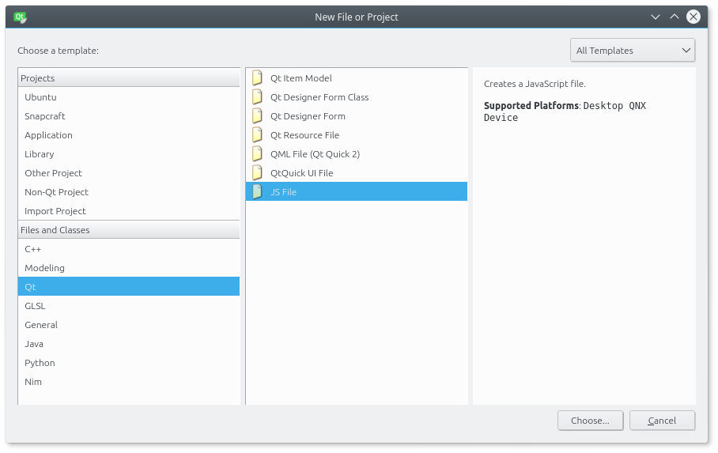
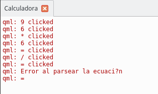

# Lógica de la aplicación
El nuevo diseño de la calculadora es más sencillo de mantener debido a los cambios realizados en la entrega anterior. Se ha pasado de un diseño inicial que tenía una función por botón a otro en el que cada botón puede tener varias funciones. En el proceso se mostró la forma de crear componentes personalizados para que la apariencia fuera similar a la de una calculadora real.

Al usar componentes personalizados se perdió la conexión entre la lógica y el interfaz de usuario. En esta entrega se resolverá el problema para conseguir la misma funcionalidad que había inicialmente y al mismo tiempo permitir funciones nuevas.

He subido un vídeo a [Youtube con una demo de la calculadora funcionando](https://youtu.be/WYyeR2JTeVg). También está publicada en la tienda de Ubuntu [la versión actual de la calculadora](https://uappexplorer.com/app/calculadora.innerzaurus). Espero que os guste esta entrega y feliz 2017.


## Versión inicial
El componente personalizado (**ButtonCalculator**) está formado por varios elementos que forman el botón. El rectángulo que pinta el botón tiene asociado un área sensible (**MouseArea**) que genera una señal cuando el usuario pulsa el botón o lo suelta. Es en ese punto de la aplicación donde se conectará la lógica entre el interfaz y los cálculos.


El área sensible corresponde a este código

```js
MouseArea {
        id: mouseArea
        anchors.fill: parent

        // Permitirá modificar el botón cuando el ratón pasa por encima
        hoverEnabled: true
        onPressed: {
                console.log(text + " clicked")
                originalColor = gradcolor
                gradcolor = Qt.lighter(gradcolor)
        }
        ...
}
```

En QML los componentes generan señales cuando se produce un cambio en su estado. Esas señales se capturan con un handler, que ejecuta el código asociado. Hay dos handlers en el MouseArea. El primero es **onPressed** y se activa cuando el usuario pulsa el botón mientras que el segundo es **onReleased** y se activa al soltar el botón. De momento se trabajará con el primer handler.


## Versión nueva
La versión inicial de la calculadora usaba una lógica simple. El usuario introducía el primer número, la operación y el segundo número. Al pulsar el botón **=** se realizaban los cálculos. El problema de esta aproximación es que las operaciones tienen que seguir siempre el mismo flujo. Si se pretende encadenar operaciones no se puede hacer con el código actual.

Por ejemplo, la operación **2 + 5** se puede realizar en el código inicial pero no se puede calcular la operación **2 + 3 / 8 * -5**. Si se pretende que la calculadora sea una aplicación práctica es necesario que se pueda trabajar de la segunda forma.

En lugar de procesar las operaciones de forma manual, tal como se hacía inicialmente, se usará la función **eval()** que tiene JavaScript. La función eval() toma una cadena de texto y la evalúa de forma que extrae las operaciones y hace los cálculos. Lógicamente tiene algunas limitaciones que se verán más adelante.

Podéis ver un resumen de las diferencias en la lógica en la siguiente tabla.

|  | Versión inicial | Versión nueva |
| --- | --- | --- |
| Lógica definida en | MathFunctions.js | CalculatorLogic.js |
| Introducción de los datos | Botones | Botones |
| Lectura de los datos | Variables internas |Contenido del display|
| Activación de la lógica | Forma individual | Forma global |

## Creación del archivo JavaScript
Para crear un nuevo archivo JavaScript y asignarlo al proyecto los pasos son los siguientes.

* Menú File, New File or Project.
* Hay que seleccionar **JS File**.


* El siguiente paso es escribir el nombre del archivo. En este caso es CalculatorLogic. No hace falta poner la extensión.


* No es necesario marcar ninguna opción en esta pantalla. Pulsad en el botón Next.


* El último paso corresponde al resumen. Si el proyecto tiene configurado un control de versiones se añadirá el archivo de forma automática.


Ya está todo preparado. Es el momento de empezar a escribir el código.

## Conexión entre el interfaz y la lógica
Cada vez que se pulse un botón **se procesa el botón en el archivo CalculatorLogic**. Para ello será necesario pasarle el texto que tiene el botón y analizarlo (parsearlo). Con el fin de poder usar operaciones encadenadas en la calculadora se toma como fuente de datos el contenido del display. El usuario introduce las operaciones y cuando pulsa el igual se realizan los cálculos.

En el archivo **Main.qml** hay que hacer el siguiente cambio:
```js
Component.onCompleted: MathFunctions.start(primerNumero, operacion,
                                               segundoNumero, resultado)
```
Por el código:

```js
Component.onCompleted: Calculator.init()
```

Puede llamar la atención que el archivo JavaScript que se ha creado inicialmente se llamaba CalculatorLogic mientras que en el código se usa un nombre diferente. En QML se pueden importar archivos de JavaScript que tengan métodos que se quieren usar. Para poder usar estos métodos hay que añadir una línea al principio del archivo. Después del "as" se pone el nombre con el que accederemos a los métodos del archivo.

```js
import "CalculatorLogic.js" as Calculator
```

Los siguientes pasos se realizan en el archivo CalculatorLogic.js

# Métodos del archivo CalculatorLogic
El primer paso es crear el método init(). La lógica es sencilla ya que se limpia la pantalla de la calculadora y se muestra el mensaje por la consola.

```js
function init() {

    // Valores iniciales
    display.text = ""

    // Mensaje de inicio
    console.log("Initialization of logic")
}
```

Los botones de la calculadora se han inicializado en el archivo QML mientras que la pantalla se inicializa en la lógica. Realmente se podría haber inicializado el texto en la creación de la pantalla y evitar esta línea de código. La razón de hacerlo de esta forma es que si desconectamos el interfaz de la lógica comentando el **handled Component.onCompleted** la pantalla mostrará un texto que facilita el diseño del interfaz. De la otra forma no aparecería el texto y sería más complicado ajustar las características de la fuente que se usa.

Todos los botones llamarán la lógica desde el archivo **ButtonCalculator.qml** por lo que se debe tener un método común en el **handled onPressed** para implementar la lógica. El método se llamará **insertButton(text)** y recibirá como parámetro el texto del botón.

El bloque de código que hace la llamada al método quedaría de la siguiente forma:

```js
MouseArea {

    id: mouseArea
    anchors.fill: parent

    // Permitirá modificar el botón cuando el ratón pasa por encima
    hoverEnabled: true

    onPressed: {
        console.log(text + " clicked")
        originalColor = gradcolor
        gradcolor = Qt.lighter(gradcolor)

        CalculatorLogic.insertButton(text)
    }
    ...
}
```

Por su parte el método insertButton(text) tendría el código que se muestra a continuación.  

```js
function insertButton(text) {

    switch (text) {
    case "=":
            operationAns(text)
        break
    case "DEL":
            operationDel()
        break
    case "AC":
            operationAC()
        break
    default:
            display.text = display.text.concat(text)
        break
    }
}
```

Al ser un método común a todos los botones se usará el texto del botón o de la función asociada para saber lo que hay que hacer en cada caso. El criterio que se seguirá para gestionar todos los botones es:
* El usuario pulsa un botón.
* El método insertButton(...) recibe el texto del botón.
* Se procesa el texto del botón para saber si es un número o una tecla de operación.
* El método insertButton(...) ejecuta otro método que realiza la operación.

Realmente **insertButton(...)** se comporta como un director que ordena cosas dependiendo de la condición que se cumple. Switch es una estructura de control de flujo que se encuentra en la mayoría de los lenguajes de programación. Tiene varios casos y dependiendo del caso que se cumpla ejecuta un código u otro. Si no se cumple ningún caso se ejecuta el código que hay en default.

De la misma forma que el interfaz de usuario está dividido en varios archivos sería posible hacer lo mismo con la lógica. Se tendría un archivo central que se encarga de organizar las cosas, similar al Main.qml, y después tantos archivos como bloques tenga el interfaz. La ventaja es la misma que en el interfaz: cada bloque es independiente y pueden trabajar en él diferentes personas de forma simultánea.

A continuación se verá como ejemplo el código de tres métodos para los botones **igual**, **DEL** y **AC**. El resto de botones se implementará en la siguiente entrega aunque podéis intentar añadir métodos nuevos con las indicaciones que daré.

## Método operationAns(text)
Este método es el que se ejecuta cuando el usuario quiere calcular las operaciones que ha introducido en el display. La lógica recae en el método eval() de JavaScript que toma una expresión y la evalua. Si no aparece ningún problema devuelve el resultado de la operación.

```js
function operationAns(text) {

    try {
            var equation = display.text.trim()
            display.text = eval(equation)
    } catch (e) {
            if (e instanceof SyntaxError) {
                    console.log("Error al parsear la ecuación")
                    console.log(text)
            }
    }
}
```

Con un ejemplo se verá más claro el funcionamiento. Se tienen dos expresiones que hay que calcular:
* 2+5+10
* 2+5+10/

La primera expresión está bien definida (tiene todos los elementos) mientras que la segunda expresión tiene un error (falta el número después del cociente). El primer paso es obtener el texto del display, esto se puede hacer con **display.text**.

El método **trim()** lo que hace es eliminar los espacios del texto que se muestra en el display. En un futuro se mostrará un espacio entre los números y las operaciones de forma que sea más agradable de usar la calculadora. Una vez está el texto “limpio” de caracteres extraños se ejecuta el método eval() para realizar el cálculo.

En la primera expresión eval() devolverá el resultado mientras que en la segunda saltará una excepción. Una excepción es una forma de informar al código que algo ha salido mal. Por ejemplo, la expresión del display no es correcta. Cuando la excepción salta se ejecuta un bloque de código que permitirá informar al usuario que tiene que corregir la operación. Para no complicarlo demasiado en estos momentos, se mostrará un mensaje de error en la consola pero no se tomarán otras medidas.




Para procesar la excepción hay que poner el código “crítico” dentro de un bloque **try - catch**. Si la excepción es de tipo **SyntaxError** se muestra el mensaje de error al usuario. El resultado de la operación se añade al display para que el usuario pueda seguir trabajando.

## Método operationDel()
El funcionamiento de este método es similar al anterior. Lo único que cambia es la operación que se realiza con el texto del display. Cuando el usuario pulsa el botón DEL se tiene que borrar el último carácter que ha introducido, si es una operación discreta, o la operación completa.
* Operación discreta: 1 + 1. Se borraría el segundo 1
* Operación completa: 1 + cos(. Se borraría cos(

Por simplificar se contempla el primer caso de momento. Hay que leer el texto del display y de ese texto seleccionar desde el primer elemento hasta la última posición -1 del texto. El texto resultante se asigna de nuevo al display.

```js
function operationDel() {

    var equation = display.text
    equation = equation.substring(0, equation.length - 1)
    display.text = equation
}
```

## Método operationAc()
Después de haber visto los dos casos anteriores, el último caso es el más simple. Directamente se borra el texto que tiene el display.

```js
function operationAC() {
    display.text = ""
}
```

# Conclusiones
A lo largo de la entrega se ha visto la forma de restaurar la lógica de la aplicación. La nueva forma de gestionar los cálculos tiene ventajas respecto a la forma inicial ya que permite encadenar operaciones de forma sencilla. Quedarían más operaciones por añadir pero se verá más adelante. Un detalle importante si queréis añadir operaciones por vuestra cuenta es que eval() espera que las operaciones estén definidas de una forma concreta.

Una forma sencilla de probarlo es escribiendo las operaciones dentro del código y comprobando si se realiza el cálculo de forma correcta o salta la excepción. Cualquier duda que tengáis la podéis preguntar en los recursos del curso.

Esta entrega tiene asociado un vídeo en Youtube que podéis ver para comprobar si está funcionando bien vuestro código. También está disponible en la tienda de Ubuntu el paquete click con el código de la calculadora para que la podáis probar.

Por último me gustaría comentar algunos cambios que haré en el curso. El primero es que la entregas pasan a ser mensuales. Se publicará una entrega nueva el primer fin de semana de cada mes. Necesito tiempo para prepararlas y en estos momentos sólo puedo dedicarle algo de tiempo los fines de semana. Otra de las novedades es que a partir de febrero publicaré también el curso en inglés. Saldrá primero en la revista [Full Circle Magazine](http://fullcirclemagazine.org/) y después en la [web del curso](https://www.gitbook.com/book/mimecar/curso-de-programacion-de-ubuntu-phone-touch).
