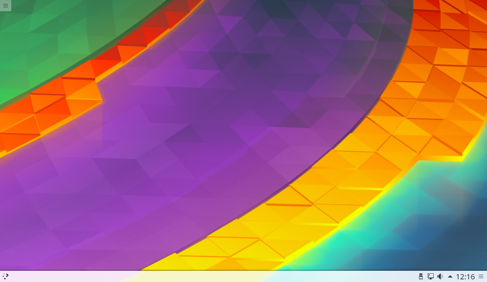

# Introducción

Uno de los cambios más importantes de este bloque es la filosofía de trabajo. La calculadora se ha programado desde cero usando QML, JavaScript y el SDK de Ubuntu Touch. El IDE de Ubuntu Touch utiliza como base Qt Creator y lo modifica para que se puedan programar aplicaciones nativas de Ubuntu Touch. Con este SDK también se pueden programar aplicaciones de escritorio. Puede parecer razonable continuar usándolo para que sea más sencilla la portabilidad a un dispositivo móvil.

El razonamiento es válido pero tiene un pequeño problema: **el SDK es un proyecto muerto. No recibirá actualizaciones que arreglen bugs ni tampoco se pueden aprovechar las novedades que incluyen las últimas versiones de Qt.** Al trabajar con las herramientas de escritorio estos problemas desaparecen. La parte negativa es que la migración del código al SDK puede ser más costosa. 

El primer objetivo es desarrollar una aplicación útil que sea relativamente compleja. Para tener usuarios en una plataforma necesitas aplicaciones que cubran sus necesidades. El segundo objetivo es poder programar usando herramientas robustas. Qt Creator es muy cómodo de usar y se puede instalar en diferentes sistemas operativos sin tener que depender de una máquina virtual. Por último, también me interesa aumentar el número de usuarios que siguen el curso.

## El gestor de tareas

La aplicación que he elegido para este bloque es un gestor de tareas. El usuario apunta las tareas del día a día y luego las puede ver de diferentes formas. Inicialmente trabajará de forma local pero más adelante se podrá sincronizar con unidades de red o aplicaciones Web. La misma aplicación debería funcionar en UBports y en el escritorio.

Voy a tomar como base el excelente [gestor de tareas Todoist](https://todoist.com). Es una herramienta **multiplataforma que tiene un API abierta** y la cuenta premium tiene un coste reducido. El gestor de tareas se sincronizará inicialmente con Todoist pero no descarto otras plataformas. Las tareas se introducirán en el escritorio / UBports y se podrá acceder a la información en el navegador Web o en un dispositivo con Android sin tener que hacer trabajo extra.

## El entorno de desarrollo

Como he comentado antes, **el IDE de Ubuntu Touch y Qt Creator comparten una base común**. Se puede instalar Qt Creator desde los repositorios de Ubuntu pero entra en conflicto con la versión del SDK. Por esta razón he decidido crear una nueva máquina virtual que sólo tenga instalado los elementos necesarios para poder usar Qt Creator.

La distribución elegida es KDE Neon (tenía ganas de probarla) y en las siguientes imágenes se pueden ver algunas capturas de pantalla. Me gustaría recordar que Qt Creator está disponible en prácticamente todas las distribuciones de GNU/Linux y podéis usar la que más os interese. KDE Neon utiliza como base Ubuntu 16.04 por lo que puede usar también repositorios PPA.

La instalación de KDE Neon es sencilla y no entraré en detalles del proceso. Como curiosidad, en la instalación aparece un modelo de portátil de [la empresa española Slimbook](https://slimbook.es/).

Cuando termine la instalación reiniciamos el equipo y ya se puede empezar a trabajar. La pantalla inicial del escritorio es bastante limpia. 

En la siguiente entrega ya explicaré como se tienen que instalar las herramientas de programación de Qt. La filosofía de trabajo será similar a la que se ha visto hasta ahora: se crea un proyecto, se eligen los Kits de desarrollo y se empieza a programar. Hay muchos kits disponibles, incluido alguno que **permite programar aplicaciones Qt para Android**.

# Documentación

Para este bloque usaré la [documentación de Qt](https://doc.qt.io/) y de forma puntual [la de UBports](https://api-docs.ubports.com/). También seguiré dos libros de los que aparecen en [el listado de Qt](https://wiki.qt.io/Books).

- [Qt 5 Cadaques (gratuito en inglés).](http://qmlbook.github.io/)
- [Mastering Qt 5 (inglés).](https://www.packtpub.com/application-development/mastering-qt-5)